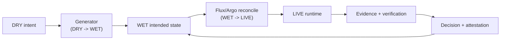
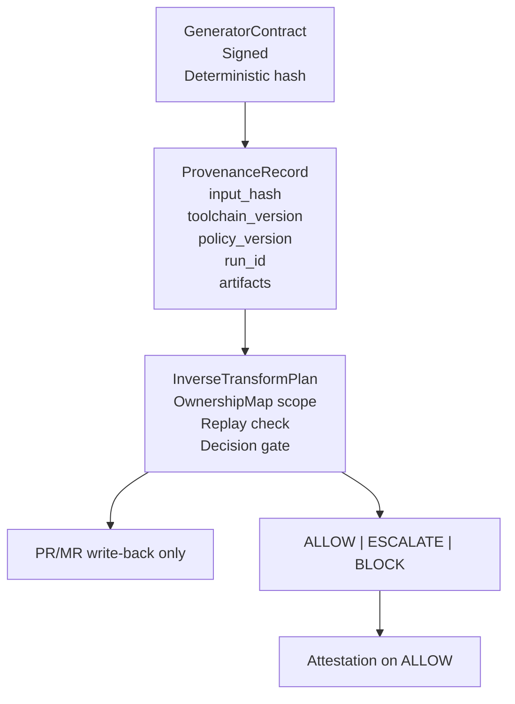
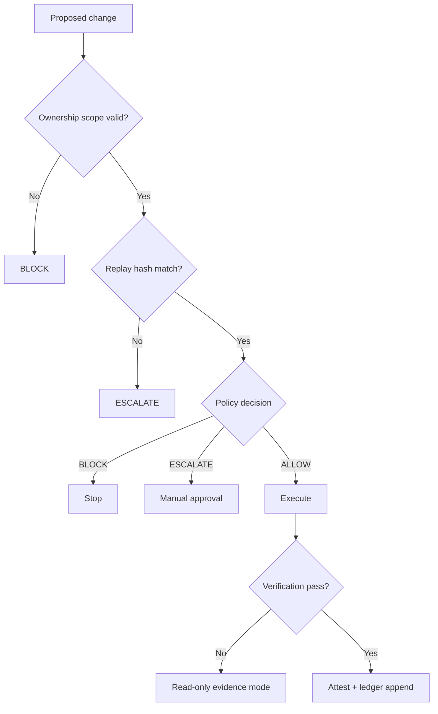
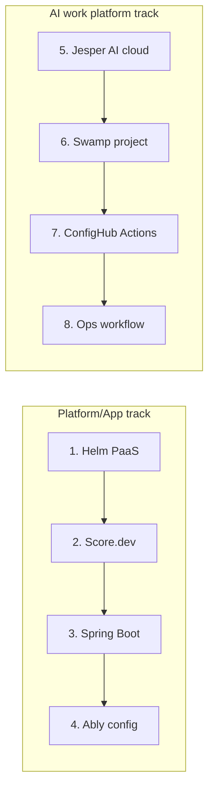

# Illustrated Cheat Sheet

**Purpose:** Fast visual reference for the operating model and demo narrative.

Qualification rule:
Use `Agentic GitOps` only when an active inner reconciliation loop (`WET -> LIVE`) exists via Flux/Argo (or equivalent reconciler). Without that loop, classify the flow as `governed config automation`.

## 1. Three-loop model

## 2. Contract triple

## 3. Enforcement outcomes

## 4. 2x4 demo map

## 5. One-line boundary

`Flux/Argo reconcile. ConfigHub decides. Git records.`
