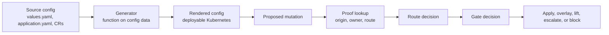
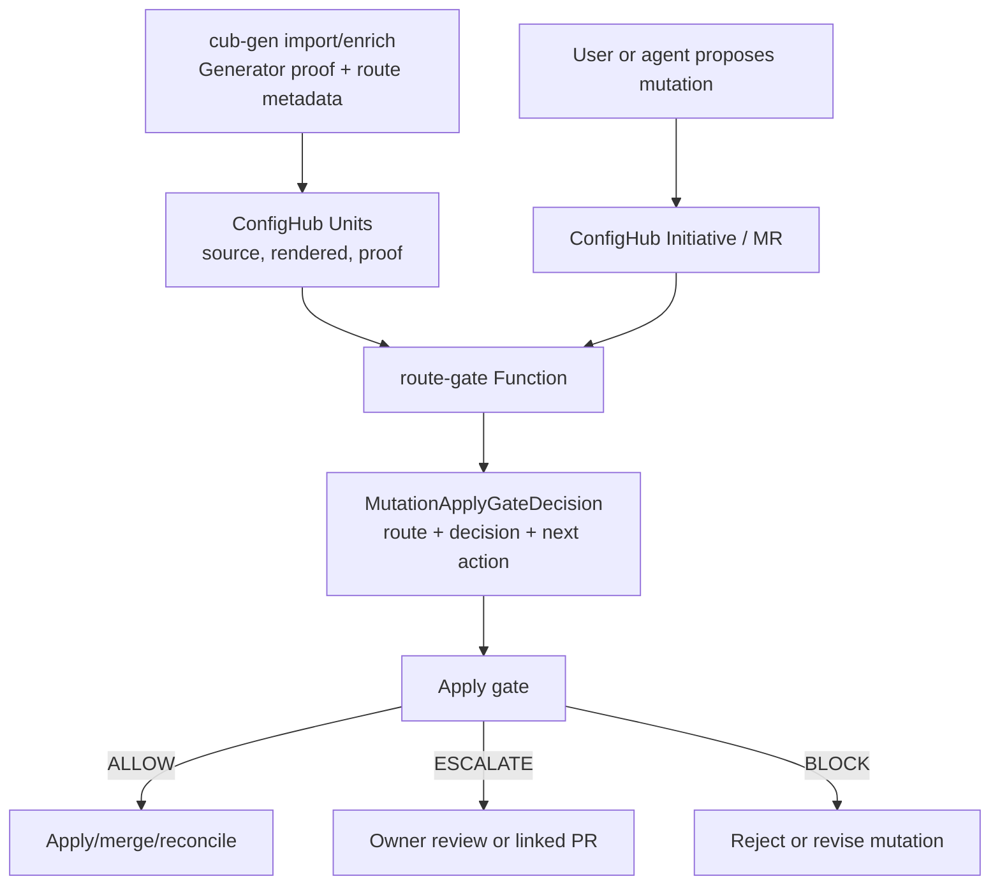

# Mutation Apply Gates: Design and PRD

## Short Answer

A **mutation apply gate** decides whether a proposed config mutation may be
applied, and if not, where the change should go instead.

The gate must return two different things:

```text
route:    where the change belongs
decision: whether the routed change may proceed
```

That keeps the product model simple:

```text
Proposed mutation
  -> Route decision
      apply-here
      overlay
      lift-upstream
      block/escalate
  -> Gate decision
      ALLOW
      ESCALATE
      BLOCK
  -> Action
      apply mutation
      keep as overlay
      create/link source PR
      request owner review
      reject
```

This is the practical answer to:

```text
If this deployed field is wrong, where do I fix it?
```

## Why This Exists

Most app platforms generate deployable Kubernetes config now. Helm, Spring
platforms, Score.dev, OpenChoreo-style CRDs, Argo ApplicationSets, app-of-apps,
workflow frameworks, and Kubara-style platform config all behave like
Generators in this sense:

```text
Generator(source config, environment context, platform context)
  -> deployable Kubernetes config
```

That is useful, but it creates a Day 2 problem. Users often see the rendered
config first. They want to change a field. If the platform only says "do not
edit generated YAML", the next step is usually a feature request, then another
parameter, then another, until the platform rebuilds Kubernetes badly.

Config as Data should do better. A proposed mutation to generated config is not
automatically wrong. It is evidence. The system should ask:

```text
Where did this field come from?
Who owns it?
Is this the right layer to change?
If not, where should the change go?
Can the routed change proceed now?
```

Mutation apply gates are the enforcement point for those questions.

## Origins

This design gathers four threads that were previously separate.

The immediate discussion started from the OpenChoreo configuration management
article and the team's debate about whether OpenChoreo-style CRDs are a leaky
abstraction or a cleaner Generator model. The answer here is deliberately
ConfigHub-shaped: keep the Generator, but make the reverse path from rendered
mutation to source/layer/action explicit.

| Origin | What it contributed |
|---|---|
| OpenChoreo discussion | Clean platform CRD models can behave more like Generators than opaque abstractions, but generated-resource ownership remains the hard part. |
| Brian/Jesper discussion | The key distinction is whether a Generator hands output back as data or keeps owning it like a controller. CaD needs a bidirectional answer for Day 2 edits. |
| Spring platform examples | The three mutation routes already existed: apply-here, lift-upstream, and block/escalate. |
| ConfigHub governance design | Later docs added explicit `ALLOW | ESCALATE | BLOCK` decisions and PR/MR linkage, but those decisions must not replace route decisions. |

Earlier references in this repo:

| Reference | Existing idea |
|---|---|
| [Generators PRD](10-generators-prd.md) | Policy gate before write-back; out-of-scope writes block; replay mismatch escalates. |
| [Field-Origin Maps](20-field-origin-maps-and-editing.md) | Rendered fields can trace back to source fields and inverse edit hints. |
| [Governed Execution](40-governed-execution.md) | Decisions gate execution and attestation. |
| [Dual Approval](50-dual-approval-gitops-gh-pr-and-ch-mr.md) | GitHub PRs and ConfigHub MRs can share one `change_id`. |
| [Platform Generators Manifesto](90-platform-generators-manifesto.md) | Platforms should be imported as Generators, not replaced. |
| [PR/MR Linkage Contract](../../contracts/pr-mr-linkage-and-dry-promotion.md) | Review systems can be linked, but linkage is a coordination layer, not the route decision itself. |
| [Spring Boot example](https://github.com/confighub/cub-gen/tree/main/examples/springboot-paas) | Runnable proof for apply-here, lift-upstream, and block/escalate. |

## Product Principle

Do not treat every generated-config edit as forbidden.

Treat every generated-config edit as a proposed mutation with proof:

```text
Forward path:
  source config -> Generator -> rendered config

Reverse path:
  rendered config mutation -> route -> gate -> action
```



## Terms

| Term | Meaning |
|---|---|
| Mutation | A proposed change to config data. It may start in ConfigHub, Git, a UI editor, a generated artifact, or a live/break-glass observation. |
| Apply | Make the mutation effective in the relevant ConfigHub/Git/reconcile flow. This does not always mean `kubectl apply`. |
| Gate | A required decision point before the mutation becomes effective. |
| Route | Where the change belongs. |
| Decision | Whether the routed action may proceed. |
| Proof | Field origin, owner, Generator, route metadata, source location, rendered location, and decision evidence. |
| Link | Optional coordination between a ConfigHub MR and one or more GitHub PRs. |

## Route Model

Route is not policy approval. Route answers where the change belongs.

| Route | Meaning | Direct rendered mutation? | Typical next action |
|---|---|---|---|
| `apply-here` | The current ConfigHub/source layer is the right place to mutate. | Allowed if policy passes. | Apply ConfigHub MR or source patch. |
| `overlay` | Keep the change as a deployment-specific overlay or exception. | Allowed if owner/policy accepts it. | Record overlay proof and expiry/review policy. |
| `lift-upstream` | The change is valid, but belongs in source config, code, chart, CR, or platform input. | Block direct rendered mutation. | Create or link source PR/MR. |
| `block/escalate` | The field crosses an ownership, safety, or platform boundary. | Block unless an owner exception is approved. | Escalate to owner or reject. |
| `review-required` | Provenance is missing, ambiguous, stale, or unsupported. | Do not silently allow. | Human review or import/enrichment first. |

## Decision Model

Decision answers whether the routed action may proceed.

| Decision | Meaning |
|---|---|
| `ALLOW` | The routed action can proceed with recorded evidence. |
| `ESCALATE` | The routed action needs an owner, reviewer, missing proof, or extra approval. |
| `BLOCK` | The routed action must not proceed. |

Important: `lift-upstream` is not the same as `BLOCK`.

`lift-upstream` often means the user found a real desired change, but attempted
it in the wrong layer. The gate should block the direct rendered mutation and
help create or link the upstream change.

## Gate Output

A mutation apply gate should emit a stable decision object.

```yaml
apiVersion: cub.confighub.io/v1
kind: MutationApplyGateDecision
change_id: chg_123
gate:
  name: generator-route
  version: v1
subject:
  component: checkout-api
  variant: checkout-api-prod
  target: prod-us-east
mutation:
  origin: confighub-mr
  rendered_field: Deployment/spec/template/spec/containers/0/env/REDIS_URL
  attempted_layer: rendered-config
proof:
  generator: springboot
  source_field: spring.cache.type
  source_file: src/main/resources/application.yaml
  owner: app-team
  confidence: 0.94
route:
  kind: lift-upstream
  direct_rendered_mutation: blocked
decision:
  state: ESCALATE
  reason: change requires source config and dependency update
next_actions:
  - kind: create-or-link-github-pr
    repo: github.com/example/checkout-api
    files:
      - pom.xml
      - src/main/resources/application.yaml
link:
  mode: paired
  confighub_mr: mr_456
  github_pr: null
```

## Examples

### Helm

Helm is already a Generator.

```text
Chart.yaml + values.yaml + values-prod.yaml + Helm CLI
  -> rendered Deployment, Service, ConfigMap
```

| Proposed mutation | Proof says | Route | Decision | Action |
|---|---|---|---|---|
| Change replicas from 3 to 5 | Field came from `values-prod.yaml: replicaCount`, app-owned | `apply-here` | `ALLOW` if scaling policy passes | Patch values file or ConfigHub source Unit. |
| Change image tag | Field came from `values-prod.yaml: image.tag` | `apply-here` or `ESCALATE` by environment | `ALLOW` for dev, `ESCALATE` for prod | Link release PR/MR if needed. |
| Change generated `securityContext` | Field came from chart template or platform values | `lift-upstream` or `block/escalate` | `ESCALATE` or `BLOCK` | Create platform chart PR or reject. |
| Patch rendered Deployment by hand | Rendered object is Helm output | Route based on field origin | Usually block direct rendered edit | Propose source patch instead. |

Plain English UI:

```text
This Deployment field came from values-prod.yaml.
Patch values-prod.yaml instead of the rendered Deployment.
Decision: ALLOW.
```

### Kubara-Style Platform Config

Kubara-style platforms start from platform/app config and generate a Kubernetes
platform stack, app projects, Helm releases, policies, DNS, and secret wiring.

```text
config.yaml + project config + environment settings
  -> platform/app Kubernetes config
```

| Proposed mutation | Proof says | Route | Decision | Action |
|---|---|---|---|---|
| Add a new app/project | Project is declared in platform config | `apply-here` | `ALLOW` if naming/quota pass | Apply Initiative/MR. |
| Clone app to prod target | Deployment Variant has target but unresolved placeholders | `apply-here` after adaptation | `BLOCK` until placeholders resolve | Run `vet-placeholders`; fill target/connections. |
| Change ingress class or certificate issuer | Shared platform default | `block/escalate` | `ESCALATE` | Platform owner review. |
| Patch generated Helm/Kubernetes output | Output came from platform Generator | Field-dependent | Block direct edit unless overlay accepted | Route to config.yaml, project file, or overlay. |

Plain English UI:

```text
This new prod deployment still has placeholders.
The mutation is valid, but apply is blocked until target and connection values are adapted.
```

### Spring

Spring is the clearest app example because users understand
`application.yaml`, not generated Kubernetes wiring.

```text
Spring code + application.yaml + platform policy
  -> ConfigMap, Deployment, Service, probes, env wiring
```

| Proposed mutation | Proof says | Route | Decision | Action |
|---|---|---|---|---|
| Change `feature.inventory.reservationMode` | App-owned Spring config | `apply-here` | `ALLOW` | Mutate embedded `application.yaml` payload or source config. |
| Add Redis caching | Requires `pom.xml` and Spring config | `lift-upstream` | `ESCALATE` | Block rendered edit; create/link app PR. |
| Change `spring.datasource.url` | Platform-owned connection/secret wiring | `block/escalate` | `BLOCK` or `ESCALATE` | Reject direct edit or route to connection owner. |
| Change probe path | Generated from platform/Spring convention | `lift-upstream` or `block/escalate` | `ESCALATE` | Fix Generator/platform rule if broadly wrong. |

Plain English UI:

```text
You tried to edit spring.datasource.url in rendered config.
That is connection wiring, not app config.
Decision: BLOCK direct edit.
Next action: request a Connection change from the platform owner.
```

### OpenChoreo-Style Platform

OpenChoreo-style systems use source CRs such as Workload, ComponentType,
ReleaseBinding, SecretReference, and rendered releases.

```text
Workload + ComponentType + ReleaseBinding + SecretReference
  -> rendered Kubernetes resources
```

| Proposed mutation | Proof says | Route | Decision | Action |
|---|---|---|---|---|
| Change environment variable value | Came from ReleaseBinding/environment data | `apply-here` | `ALLOW` if env owner approves | Patch binding/source Unit. |
| Change image | Came from Workload | `lift-upstream` | `ALLOW` or `ESCALATE` | Patch Workload source. |
| Change service port contract | Came from ComponentType/platform contract | `lift-upstream` or `block/escalate` | `ESCALATE` | Platform PR/MR. |
| Change secret reference | Came from SecretReference/security flow | `block/escalate` | `ESCALATE` or `BLOCK` | Security owner review. |
| Edit generated Deployment directly | Rendered resource is generated output | Field-dependent | Direct edit blocked unless overlay accepted | Route to CR, overlay, or owner. |

Plain English UI:

```text
This Deployment is generated from OpenChoreo source CRs.
The requested field belongs in the Workload, not in the rendered Deployment.
Decision: block direct rendered mutation; propose Workload patch.
```

## MR-PR Linkage

MR-PR linkage is optional coordination, not the route decision itself.

The route decides where the change belongs. Linkage decides whether a ConfigHub
MR and one or more GitHub PRs should be correlated under one `change_id`.

| Link mode | Meaning |
|---|---|
| `none` | ConfigHub MR is enough. |
| `advisory` | Show a suggested GitHub PR, but do not require it. |
| `paired` | Create or link GitHub PR and ConfigHub MR under one `change_id`. |
| `blocking` | ConfigHub MR cannot apply until the linked PR is approved or merged. |

Recommended defaults:

| Route | Default link mode |
|---|---|
| `apply-here` | `none` or `advisory` |
| `overlay` | `none`, with review/expiry metadata |
| `lift-upstream` to app repo | `paired` |
| `lift-upstream` to platform repo | `paired` or `blocking` |
| `block/escalate` | `none` until an exception/remediation path is chosen |

## Enforcement Levels

There are three useful enforcement levels. They should not be confused.

| Level | What it guarantees | Needs ConfigHub core write-path changes? |
|---|---|---|
| Advisory proof | CLI/UI can explain route and decision. | No |
| Initiative/apply gate | MR/Initiative cannot apply until the gate decision passes. | Probably no, if Functions, policy, and apply gates are enough. |
| Write-path enforcement | Direct API/UI mutation is rejected or escalated before it lands. | Yes, unless ConfigHub already has a non-bypassable policy hook. |

For v0.4, #283 should target the second level first:

```text
Initiative route gate:
  every proposed mutation must explain where the field came from,
  where the change belongs,
  and whether the routed action may proceed.
```

The later hardening step can add write-path enforcement in ConfigHub core.

## Near-Term Architecture With Initiatives

The first useful version should be possible with ConfigHub Functions,
Initiatives, apply gates, and policy. It does not need to start as a hard
server mutation-endpoint change.



Responsibilities:

| Surface | Responsibility |
|---|---|
| `cub-gen` | Detect Generators, emit field origins, route metadata, source targets, and optional patch bundles. |
| ConfigHub Function | Evaluate proposed mutation against proof and policy. |
| Initiative/MR | Carry the proposed mutation, decision, review state, and optional MR-PR links. |
| Apply gate | Prevent apply/merge/reconcile until the decision is acceptable. |
| ConfigHub core write path | Later hardening for direct UI/API mutation bypass. |

This matters for #283 because the product value is the gate decision, not the
mechanism that runs it. A non-bypassable write-path hook is stronger, but an
Initiative/apply gate is enough to prove the route model in governed flows.

## Functional Requirements

### FR1: Gate Input

The gate must accept:

1. proposed mutation diff,
2. actor and ownership context,
3. Component, Variant, Target, and Connection context when known,
4. Generator proof,
5. field origin map or route metadata,
6. optional ConfigHub MR and GitHub PR context,
7. policy version and route policy version.

### FR2: Route Evaluation

The gate must resolve each changed field to one route:

1. `apply-here`,
2. `overlay`,
3. `lift-upstream`,
4. `block/escalate`,
5. `review-required`.

If multiple fields change, the gate must emit per-field routes and one aggregate
decision.

### FR3: Decision Evaluation

The gate must return one aggregate decision:

1. `ALLOW`,
2. `ESCALATE`,
3. `BLOCK`.

Aggregate rules:

| Field decisions | Aggregate decision |
|---|---|
| all `ALLOW` | `ALLOW` |
| any `BLOCK` | `BLOCK` |
| no `BLOCK`, one or more `ESCALATE` | `ESCALATE` |
| missing/ambiguous proof | `ESCALATE` with reason `review-required` |

### FR4: Direct Mutation Handling

For generated rendered config:

| Route | Direct rendered mutation |
|---|---|
| `apply-here` | allowed only if this layer is declared mutable and policy passes |
| `overlay` | allowed only as an explicit overlay with owner, scope, and proof |
| `lift-upstream` | blocked; source proposal required |
| `block/escalate` | blocked unless approved exception path exists |
| `review-required` | blocked from automatic apply |

### FR5: Next Actions

The gate must return one or more next actions:

1. apply ConfigHub MR,
2. patch source Unit,
3. create or link GitHub PR,
4. create or link platform PR/MR,
5. keep as overlay,
6. request owner review,
7. reject mutation,
8. import/enrich proof first.

### FR6: MR-PR Linkage

The gate must support optional linkage metadata:

1. `mode: none`,
2. `mode: advisory`,
3. `mode: paired`,
4. `mode: blocking`.

The first implementation may emit the intended link mode without creating PRs.

### FR7: Degradation

Unsupported or incomplete cases must degrade explicitly.

| Condition | Required behavior |
|---|---|
| missing provenance | `ESCALATE`, reason `review-required` |
| unknown Generator | `ESCALATE`, reason `unsupported-generator` |
| stale proof or replay mismatch | `ESCALATE`, reason `replay-mismatch` |
| out-of-scope write | `BLOCK`, reason `out-of-scope` |
| no GitHub token for lift-upstream PR | `ESCALATE`, link mode downgraded to `advisory` |
| source repo not writable | `ESCALATE`, reason `source-not-writable` |

### FR8: Audit

Every gate decision must record:

1. `change_id`,
2. actor,
3. policy version,
4. Generator proof digest,
5. route decision,
6. aggregate decision,
7. next action,
8. MR/PR linkage state when present.

## Non-Goals

1. Do not replace Helm, OpenChoreo, Spring, Score.dev, Kubara, Argo, or internal platforms.
2. Do not require all users to abandon source config and only edit rendered data.
3. Do not require ConfigHub core write-path enforcement for the first useful version.
4. Do not create source PRs automatically without an explicit link mode and permissions.
5. Do not pretend every rendered edit has a perfect inverse. Ambiguity must escalate.

## #283 Implementation Slice

Issue #283 should be reframed from only "server-side route enforcement" to:

```text
Mutation apply gates for Generator route decisions.
```

### MVP Scope

1. Define the decision object shape above as the v1 contract.
2. Implement or simulate an Initiative/apply-gate function that evaluates route
   metadata from imported proof.
3. Return both `route.kind` and `decision.state`.
4. Allow app-owned `apply-here` fields.
5. Block direct rendered mutation for `lift-upstream` fields and return source
   proposal instructions.
6. Block or escalate `block/escalate` fields.
7. Treat missing proof as `ESCALATE`, not allow.
8. Emit optional MR-PR link intent, but do not require automatic PR creation.

Current cub-gen implementation: `gate mutation` emits this decision object from
Spring `field-routes.yaml`, route-policy files, or published cub-gen bundles.
It includes `decision_digest` plus `proof_events[]`, so Pilot, validation, and
attestation tooling can log or extract the gate proof with `proof events`.
ConfigHub Initiatives/apply gates can display the same object as the v0.4 UI
surface; non-bypassable core write-path enforcement is a later hardening step
if needed.

### Proof Matrix

| Proof | Required for #283 MVP |
|---|---|
| unit | route + decision evaluator matrix |
| golden | stable `MutationApplyGateDecision` JSON/YAML for representative examples |
| example | Spring apply-here, Spring lift-upstream, Spring datasource block |
| example | Helm values change allowed, chart/platform field escalated |
| example | OpenChoreo rendered Deployment edit routes to CR/source/owner |
| degradation | missing proof escalates to review-required |
| docs | this spec plus Spring caveat update |
| connected | connected smoke records one mutation apply gate decision; ConfigHub Initiative/apply-gate display is the intended UI surface |

### Later Scope

1. ConfigHub write-path enforcement for direct UI/API mutations.
2. First-class UI route badges and "fix it here" actions.
3. Automatic paired GitHub PR creation for `lift-upstream`.
4. Blocking MR-PR linkage mode.
5. Overlay expiry/review policy.
6. Multi-repo source proposal waves.
7. Policy packs for common Generator families.

## User Experience

Good gate output should be plain:

```text
You changed:
  Deployment/spec/template/spec/containers/0/env/REDIS_URL

That field came from:
  src/main/resources/application.yaml: spring.cache.type

Route:
  lift-upstream

Decision:
  ESCALATE

Why:
  Redis caching needs a source config change and a Maven dependency.

Next:
  Create or link a GitHub PR for pom.xml and application.yaml.
  Keep the ConfigHub MR linked under change_id chg_123.
```

For a blocked platform-owned field:

```text
You changed:
  spring.datasource.url

That field is owned by:
  platform-engineering

Route:
  block/escalate

Decision:
  BLOCK

Why:
  Datasource wiring is managed through Connection and SecretReference policy.
```

## Open Questions

1. Which ConfigHub Function or Initiative hook should own the first
   implementation?
2. Should `overlay` be a first-class route in every Generator family or only in
   platform-style Generators?
3. Which teams can approve `ESCALATE` decisions by route and field owner?
4. When should `lift-upstream` create a GitHub PR automatically versus only
   emitting a patch bundle?
5. Should blocking MR-PR linkage wait for a core ConfigHub linkage object or
   use the existing `change_id` bridge record first?
6. What is the minimum UI surface: route badge, gate decision, next action, or
   full proof tree?

## Bottom Line

Mutation apply gates are the missing bridge between Generators and Config as
Data.

They keep Generators useful without letting them become one-way abstractions.
They let users start from the field they see, then route the change to the
right layer with proof.

The product promise is:

```text
Generated config is still config data.
If you change it, ConfigHub can explain whether to apply here,
keep as overlay, lift upstream, or block/escalate.
```
