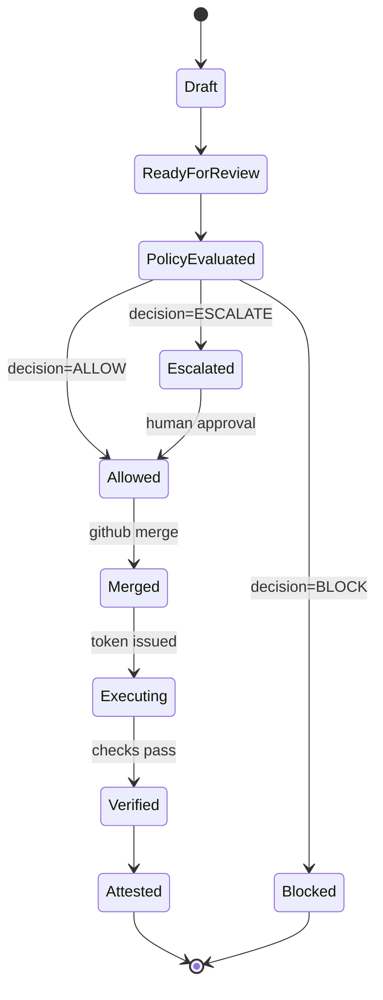

# Dual-Approval GitOps: GitHub PR <-> ConfigHub MR

Status: proposal (implementation-ready reference)  
Last updated: 2026-02-28

## Purpose

Define a bidirectional workflow where:

1. Teams can start from GitHub PRs or from ConfigHub Merge Requests (MRs).
2. Teams can also start from live-cluster observations captured as ConfigHub MR proposals.
3. GitHub remains the source merge authority.
4. ConfigHub remains the governed execution authority.
5. Flux/Argo remain reconcilers.
6. OCI is the default WET transport.

This gives users both entry points without split-brain approvals.

## Invariants

1. Nothing implicit ever deploys.
2. GitHub merge approval is not deployment approval.
3. ConfigHub `ALLOW|ESCALATE|BLOCK` is required for governed apply.
4. One canonical `change_id` links all artifacts across systems.
5. One canonical content commit (`merged_sha`) is the source truth.
6. Nothing observed from live state silently overwrites DRY intent.

## Authority Boundary

1. GitHub decides source-code merge (`open`, `review`, `merge`, `close`).
2. ConfigHub decides execution (`ALLOW|ESCALATE|BLOCK`, attestation).
3. Flux/Argo reconcile runtime state from published WET artifacts.
4. ConfigHub Actions executes only with scoped token issued after `ALLOW`.

## Shared Change Identity Contract

Every candidate mutation carries these minimum fields:

```yaml
change_id: chg_01JYQ0Y7V8VY2N8B7T7S6E3M4N
source:
  repo: github.com/acme/platform-gitops
  base_branch: main
  head_branch: feat/checkout-probe-tune
  head_sha: 3e8c8fb3f3d6b5...
  merged_sha: null
links:
  github_pr: 1842
  github_pr_url: https://github.com/acme/platform-gitops/pull/1842
  confighub_mr: mr_9f29a5c
  confighub_card: card_f0312a9
delivery:
  wet_transport: oci
  artifact_ref: ghcr.io/acme/platform/checkout@sha256:ab44...771e
decision:
  result: PENDING
  tier: 2
```

## Bidirectional Entry Paths

### Path A: GitHub PR -> ConfigHub MR

1. Developer or agent opens GitHub PR.
2. Integration creates/updates ConfigHub MR using same `change_id`.
3. ConfigHub renders/ingests candidate WET and evaluates policy.
4. ConfigHub posts decision status back to GitHub checks.
5. GitHub reviewers merge PR when source review is complete.
6. Integration updates `merged_sha` in ConfigHub MR.
7. ConfigHub executes governed apply only after `ALLOW` (or approved `ESCALATE`).
8. ConfigHub writes attestation and links it to PR + MR + execution receipts.

### Path B: ConfigHub MR -> GitHub PR

1. User edits DRY units in ConfigHub (base/app/params).
2. ConfigHub creates branch + GitHub PR via bot identity.
3. ConfigHub MR and GitHub PR are linked by same `change_id`.
4. GitHub handles normal code review and merge.
5. After merge, ConfigHub runs governed decision flow.
6. On `ALLOW`, scoped token enables execution runtime.
7. Flux/Argo reconcile published WET artifact.
8. ConfigHub finalizes attestation and outcome receipts.

### Path C: LIVE observation -> ConfigHub MR proposal

1. Observer tooling detects live mutation or drift (`cub-scout`/evidence adapters).
2. ConfigHub creates a proposal MR from live evidence using a new `change_id`.
3. Proposal includes live snapshot, drift class, and suggested DRY patch; no source is overwritten automatically.
4. Reviewer decides to either discard/revert live state or accept and continue as a source change.
5. If accepted, ConfigHub opens/updates paired GitHub PR (or internal source branch) with proposed DRY edits.
6. Source merge happens through normal approval policy.
7. ConfigHub applies governed decision (`ALLOW|ESCALATE|BLOCK`) for execution/promotion.
8. Attestation links live evidence, source merge, and outcome under one `change_id`.

## State Machine (Single Logical Change)



Execution gating rule:

1. `Executing` requires both `Merged` and `decision in {ALLOW, approved ESCALATE}`.

## Who Clicks What

1. GitHub reviewer clicks merge.
2. ConfigHub approver clicks escalation approval (when required).
3. ConfigHub (or delegated runtime) triggers execution after decision gate.
4. Flux/Argo reconcile automatically.

## Required Events and API Surface (Minimum)

1. GitHub webhook ingest:
   `pull_request.opened`, `pull_request.synchronize`, `pull_request.closed`, `pull_request.merged`.
2. ConfigHub webhook/status callback:
   `mr.created`, `mr.updated`, `decision.updated`, `execution.completed`, `attestation.recorded`.
3. Live observation ingest:
   `live.observed`, `live.drift_detected`, `live.proposal_created`.
4. Idempotent upsert endpoint:
   `POST /v1/changes/upsert` keyed by `change_id`.
5. Link endpoint:
   `POST /v1/changes/{change_id}/links` for PR/MR/card references.
6. Decision endpoint:
   `POST /v1/changes/{change_id}/decision` with `ALLOW|ESCALATE|BLOCK`.
7. Execution endpoint:
   `POST /v1/changes/{change_id}/execute` requiring prior allow state.

## Conflict Rules

1. If PR branch diverges after CH decision, invalidate decision and re-evaluate.
2. If CH MR edits create new commit, PR is updated and prior decision is invalidated.
3. If GitHub PR closes unmerged, CH MR moves to `abandoned`.
4. If CH MR is withdrawn, bot closes PR unless explicitly detached.
5. If two CH MRs target same app/env and overlapping fields, require serialization.
6. If live state changes again while proposal MR is open, mark MR stale and require refresh/re-evaluation.

## Data Placement (DRY/WET)

1. GitHub stores source commits, PR review history, and optional compact receipts.
2. OCI stores WET deployment artifacts (digest-pinned).
3. ConfigHub stores live observation evidence, decision graph, approvals, execution telemetry, and attestation.
4. Shared IDs and digests are written back to both sides for traceability.

## Flux/Argo Compatibility

1. No reconciler replacement.
2. No required change to controller semantics.
3. Promotion can be Git-based or OCI-channel based.
4. Existing GitOps repos can adopt incrementally.

## Adoption Sequence

1. Phase 1: GitHub-first (`PR -> CH evaluate -> status checks`).
2. Phase 2: ConfigHub-authoring (`CH MR -> bot PR`).
3. Phase 3: live-observation proposals (`LIVE -> CH MR`) with explicit review before write-back.
4. Phase 4: full multi-entry state machine with strict gate enforcement.

## Positioning Line

Author intent in GitHub or ConfigHub, merge in GitHub, approve execution in ConfigHub, reconcile with Flux/Argo from OCI.

## Related Docs

1. `docs/reference/agentic-gitops-design.md`
2. `docs/reference/next-gen-gitops-ai-era.md`
3. `docs/reference/stored-in-git-vs-confighub.md`
4. `docs/reference/cub-track-mvp-upsell-and-dual-store.md`
5. `docs/reference/scoredev-dry-wet-unit-worked-example.md`
6. `docs/reference/traefik-helm-dry-wet-unit-worked-example.md`
