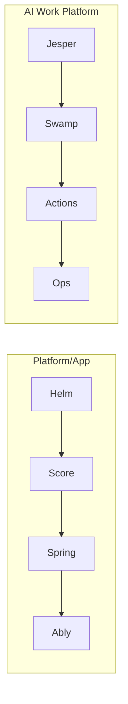

# Eight Example Story Cards

**Purpose:** Keep demo narratives simple, fast, and reusable.

Qualification rule:
Use `Agentic GitOps` only when an active inner reconciliation loop (`WET -> LIVE`) exists via Flux/Argo (or equivalent reconciler). Without that loop, classify the flow as `governed config automation`.

## 1. Example matrix (2x4)

| # | Example | Primary user story | What it proves | Entry script |
|---|---|---|---|---|
| 1 | Helm PaaS | "Keep existing Helm + GitOps, add governance." | No migration, explicit DRY/WET governance. | `examples/demo/module-1-helm-import.sh` |
| 2 | Score.dev PaaS | "Keep Score abstraction, gain provenance + field map." | DRY intent remains simple; WET is auditable. | `examples/demo/module-2-score-field-map.sh` |
| 3 | Spring Boot PaaS | "App teams stay in framework config." | Framework config to governed WET with ownership routing. | `examples/demo/module-3-spring-ownership.sh` |
| 4 | Ably config | "App-config platforms need same controls." | Non-K8s style config still fits DRY/WET + inverse mapping. | `examples/demo/module-5-ably-platform.sh` |
| 5 | Jesper AI cloud | "AI platform requests need governed runtime path." | DRY work request to verifiable WET task flow. | `examples/demo/ai-work-platform/scenario-1-jesper-ai-cloud.sh` |
| 6 | Swamp project | "Template-heavy AI project still needs provenance." | Generator + provenance + inverse write in mixed repos. | `examples/demo/ai-work-platform/scenario-2-swamp-project.sh` |
| 7 | ConfigHub Actions | "Execution must be tokened and attested." | Decision authority separated from execution runtime. | `examples/demo/ai-work-platform/scenario-3-confighub-actions.sh` |
| 8 | Ops workflow | "Operational waves need one governed change identity." | Multi-target ALLOW/ESCALATE/BLOCK with evidence chain. | `examples/demo/ai-work-platform/scenario-4-operations.sh` |

## 2. Story-map illustration

## 3. Shared value line per card

1. Keep existing GitOps runtime.
2. Add usable platform API semantics.
3. Enforce governed mutation path.
4. Preserve proof chain from intent to outcome.

## 4. Shared proof gates per card

1. Active reconciler loop is visible (`WET -> LIVE`).
2. Signed generator contract and deterministic hash exist.
3. Provenance fields are complete and immutable.
4. OwnershipMap bounds inverse writes.
5. Decision gate is explicit (`ALLOW|ESCALATE|BLOCK`).
6. Attestation on allow is present.
7. Ledger append is visible.
