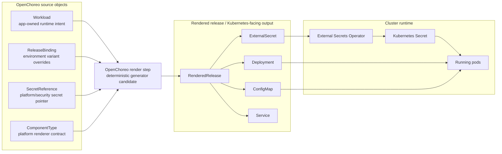
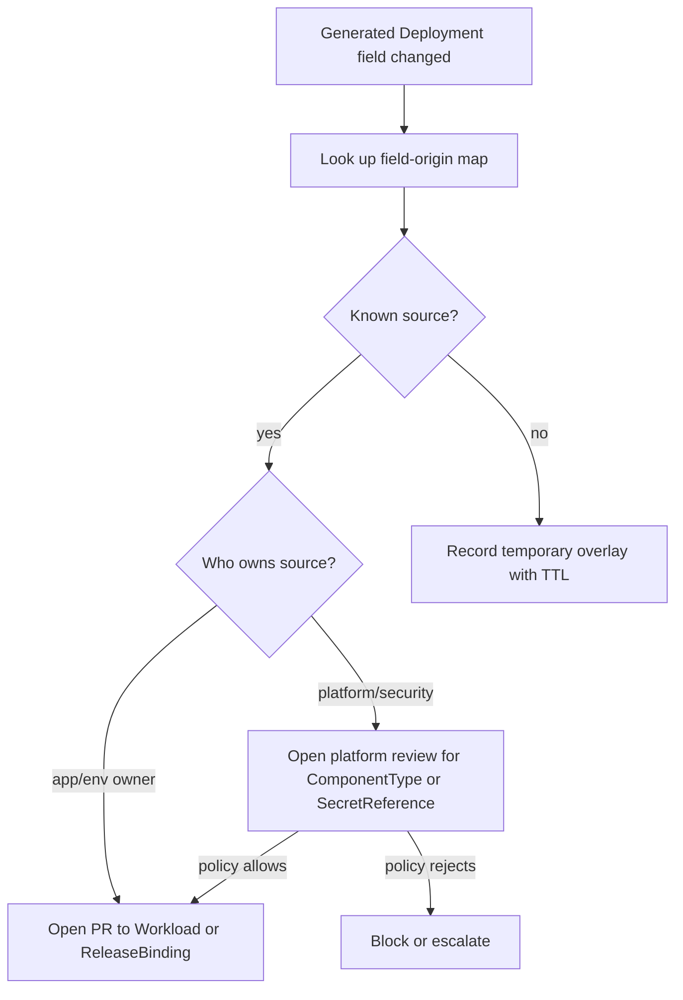
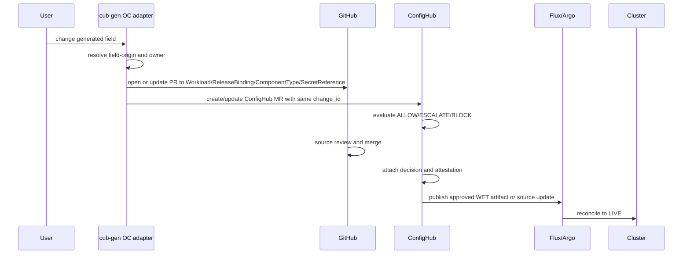

# OpenChoreo as a Clean Generator

Status: worked example, not yet an implemented `cub-gen` adapter.

This example uses OpenChoreo to teach the distinction between a brittle platform
abstraction and a clean platform generator.

Short answer: OpenChoreo looks close to the style of platform `cub-gen` wants to
import. The point is not to replace OpenChoreo. The point is to make its
generation chain inspectable, governable, and easy to connect to GitHub PRs and
ConfigHub MRs.

## Why This Example Exists

The objection from platform engineers is fair:

> If every missing Kubernetes capability becomes "file a feature request and we
> will add another parameter," the abstraction eventually becomes Kubernetes
> again, but worse.

The answer is not "make a perfect abstraction." The answer is to recognize when
the platform is really a generator:

```text
app intent + environment context + platform contract -> deployable config
```

If that function is deterministic and ownership boundaries are visible, a
change to generated output can be classified instead of turned into another
knob.

## OpenChoreo Generator Shape

OpenChoreo's configuration model is useful because the major source layers are
already named.



## Mapping to cub-gen

| OpenChoreo object | Role in the generator | cub-gen classification | Typical owner |
|---|---|---|---|
| `Workload` | Describes what the component consumes | DRY app intent | app team |
| `ReleaseBinding` | Binds a release to an environment with overrides | DRY variant input | environment owner or app team |
| `SecretReference` | Points at external secret material without storing values | DRY platform/security reference | platform or security |
| `ComponentType` | Defines how app intent becomes Kubernetes resources | generator contract / platform template | platform team |
| `RenderedRelease` | Final rendered component release for an environment | WET output bundle | platform runtime |
| `Deployment`, `ConfigMap`, `ExternalSecret` | Kubernetes-facing resources | WET targets | platform runtime |
| live `Secret`, pods, services | Runtime state | LIVE state | reconciler / cluster |

## Concrete Scenario

Assume a developer writes a `Workload` with an app env var and a secret
reference.

```yaml
apiVersion: openchoreo.dev/v1alpha1
kind: Workload
metadata:
  name: payments-api
spec:
  containers:
    main:
      env:
        - key: LOG_LEVEL
          value: info
        - key: DATABASE_PASSWORD
          valueFrom:
            secretKeyRef:
              name: database-secret
              key: password
```

Production overrides the log level in a `ReleaseBinding`.

```yaml
apiVersion: openchoreo.dev/v1alpha1
kind: ReleaseBinding
metadata:
  name: payments-api-prod
spec:
  environment: prod
  workloadOverrides:
    containers:
      main:
        env:
          - key: LOG_LEVEL
            value: error
```

The platform defines where `database-secret` comes from.

```yaml
apiVersion: openchoreo.dev/v1alpha1
kind: SecretReference
metadata:
  name: database-secret
spec:
  data:
    - secretKey: password
      remoteRef:
        key: secret/data/prod/db
        property: password
```

The platform `ComponentType` decides how those inputs become `Deployment`,
`ConfigMap`, and `ExternalSecret` resources.

## Field-Origin Map

For this component, an OpenChoreo-aware `cub-gen` adapter would emit a field map
like this.

| Rendered field | Value | Source object | Source path | Owner | Route |
|---|---:|---|---|---|---|
| `Deployment/spec/template/spec/containers[name=main]/env[name=LOG_LEVEL]/value` | `error` | `ReleaseBinding/payments-api-prod` | `spec.workloadOverrides.containers.main.env[LOG_LEVEL].value` | app/env owner | lift to variant source |
| `Deployment/spec/template/spec/containers[name=main]/env[name=DATABASE_PASSWORD]/valueFrom/secretKeyRef/name` | `database-secret` | `Workload/payments-api` | `spec.containers.main.env[DATABASE_PASSWORD].valueFrom.secretKeyRef.name` | app team | lift to app source |
| `ExternalSecret/spec/data[password]/remoteRef/key` | `secret/data/prod/db` | `SecretReference/database-secret` | `spec.data[password].remoteRef.key` | platform/security | block or route to platform review |
| `Deployment/spec/template/spec/securityContext` | platform default | `ComponentType/java-service` | renderer template | platform team | block or route to platform source |
| `ConfigMap/data/LOG_FORMAT` | platform default | `ComponentType/java-service` | standard env block | platform team | block or route to platform source |

The important bit is not only trace-back. It is routing.

## What Happens When Someone Edits Generated YAML?

Suppose an operator changes the generated `Deployment` directly.

```diff
 env:
   - name: LOG_LEVEL
-    value: error
+    value: debug
```

The bad abstraction answer is:

```text
File a feature request. We may add a new parameter.
```

The governed generator answer is:



## The Three Routes

| User request | Example | Route | Why |
|---|---|---|---|
| Change log level in prod | `LOG_LEVEL=debug` | lift upstream to `ReleaseBinding` | environment-specific app behavior |
| Change default log format for all Java services | `LOG_FORMAT=json` | platform review on `ComponentType` | shared platform default |
| Change Vault path for database password | `secret/data/prod/db2` | platform/security review on `SecretReference` | secret source ownership |
| Temporarily scale during an incident | replicas from 3 to 30 | temporary overlay with TTL, then promote or revert | emergency runtime need |
| Disable required security context | `runAsNonRoot=false` | block/escalate | platform-owned security boundary |

This is how `cub-gen` helps avoid the feature-request treadmill. It does not
promise every field is app-editable. It explains which layer owns the field and
creates the right review path.

## PR/MR Flow for an OpenChoreo App



## What cub-gen Would Import

| Import scope | Read-only result | Mutation result, later |
|---|---|---|
| One OC app repo | component field-origin map, owners, generated target list | PRs against the app `Workload` or `ReleaseBinding` |
| One OC platform repo | `ComponentType` and `SecretReference` ownership map | platform PRs with blast radius and review gates |
| Many OC repos | cross-component generator index | linked app PRs, ConfigHub MRs, and platform promotion PRs |
| Cluster-observed generated resources | overlay/drift classification | accept/revert/promote proposal |

## What Is Productized Today vs Still Work

| Capability | Status in cub-gen today | OpenChoreo-specific status |
|---|---|---|
| Generator contract triple | implemented for current generator families | adapter needed |
| Field-origin and inverse edit pointers | implemented for current generator families | adapter needed |
| Apply-here / lift-upstream / block-escalate teaching model | strongest in Spring examples | model maps cleanly |
| PR/MR linkage contract | commands and demos exist | OC wiring needed |
| Multi-repo platform import | not generic yet | needed for real OC estates |
| Automatic annotation/enrichment | not generic yet | likely useful after read-only import |
| Config rewrite/refactor proposals | limited, strongest in Spring onboarding | future OC normalization path |

## Why This Helps OpenChoreo Users

OpenChoreo users would not use `cub-gen` because they cannot render manifests.
They already can. They would use it because large teams need better answers to
these questions:

| Question | Why OC alone may not be enough | What cub-gen adds |
|---|---|---|
| Why does this generated field have this value? | the value may come from app, env, secret, or component type | field-origin map |
| Where should I edit it? | generated resources are not the source of truth | inverse edit pointer |
| Who owns this change? | ownership crosses app/platform/security lines | route classification |
| What happens if I patch generated YAML? | controller ownership makes patches fragile | overlay/lift/block decision |
| What is the blast radius of a `ComponentType` change? | platform templates affect many apps | cross-app provenance index |
| How do GitHub and ConfigHub review connect? | source review and deploy decision are different | one `change_id` across PR and MR |

## Sources and Cross-References

- Medium PDF/article supplied in the thread: "Configuration Management in OpenChoreo: Closing the Kubernetes Gap"
- OpenChoreo docs: [ComponentType](https://openchoreo.dev/docs/reference/api/platform/componenttype/), [ReleaseBinding](https://openchoreo.dev/docs/reference/api/platform/releasebinding/), [SecretReference](https://openchoreo.dev/docs/reference/api/platform/secretreference/)
- cub-gen: [Generator PRD](../02-design/10-generators-prd.md)
- cub-gen: [Field-Origin Maps and Editing](../02-design/20-field-origin-maps-and-editing.md)
- cub-gen: [Canonical Contract Triple](../../contracts/canonical-triple-and-storage-boundary.md)
