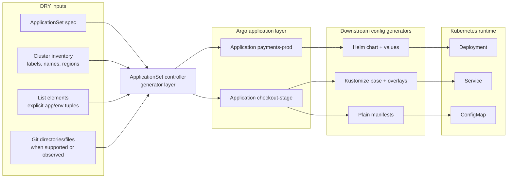
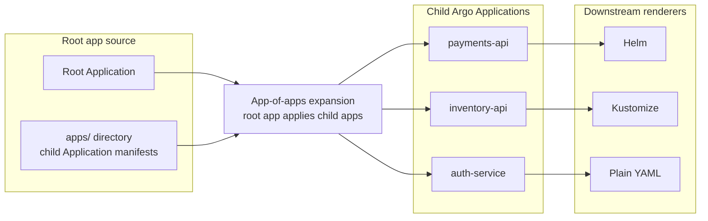

# Argo ApplicationSet and App-of-Apps as Generators

Status: worked example plus fixture-backed adapters. `ApplicationSet` has
first-class `cub-gen` support for bounded cases. App-of-apps now has a
fixture-backed generator family for the clean root Application -> child app
catalog shape.

Short answer: Argo CD is the reconciler, but many Argo setups also contain
generators. `ApplicationSet` and app-of-apps both take higher-level inputs and
produce Argo `Application` objects, which then point at Helm, Kustomize, or raw
manifest sources.

That generation step is real. If it is not modeled, users debug it by reading
YAML and controller behavior by hand.

## Why This Matters

Argo pain often comes from a hidden chain:

```text
cluster/list/git input -> Argo Application -> Helm/Kustomize/plain manifests -> Kubernetes objects
```

The user sees a broken `Deployment`, but the right edit might be:

- a cluster label used by an `ApplicationSet` selector,
- the parent `ApplicationSet` template,
- a child app path in an app catalog,
- a Helm values file,
- a Kustomize overlay,
- or a platform policy that should block the change.

`cub-gen`'s job is to make that chain visible.

## ApplicationSet Generator Shape



## App-of-Apps Generator Shape

App-of-apps is simpler structurally, but it still behaves like a generator. A
root app points at a directory or catalog of child `Application` manifests.
Those child apps then point at downstream deployable config.



## The Two Argo Generator Styles

| Pattern | Generator input | Generated object | Downstream generator | Common failure mode |
|---|---|---|---|---|
| `ApplicationSet` with list generator | explicit list elements | child `Application` objects | Helm/Kustomize/plain manifests | list entry or template field owns a child app value |
| `ApplicationSet` with clusters generator | cluster labels and inventory | child `Application` objects per matching cluster | Helm/Kustomize/plain manifests | selector changes silently alter app fanout |
| `ApplicationSet` with git generator | repo files or directories | child `Application` objects | Helm/Kustomize/plain manifests | repo shape controls deployment fanout |
| app-of-apps | root app plus child app catalog | child `Application` objects | Helm/Kustomize/plain manifests | root app owns child app lifecycle, but users debug children |

## A Concrete ApplicationSet Example

```yaml
apiVersion: argoproj.io/v1alpha1
kind: ApplicationSet
metadata:
  name: platform-apps
spec:
  generators:
    - clusters:
        selector:
          matchLabels:
            env: prod
            region: eu
  template:
    metadata:
      name: "{{name}}-payments"
    spec:
      source:
        repoURL: https://github.com/acme/payments-platform
        path: charts/payments
        helm:
          valueFiles:
            - values.yaml
            - values-prod.yaml
      destination:
        server: "{{server}}"
        namespace: payments
```

If the prod EU cluster inventory has:

```yaml
name: prod-eu
server: https://prod-eu.example
labels:
  env: prod
  region: eu
```

Then the ApplicationSet generates:

```yaml
kind: Application
metadata:
  name: prod-eu-payments
spec:
  source:
    path: charts/payments
    helm:
      valueFiles:
        - values.yaml
        - values-prod.yaml
  destination:
    server: https://prod-eu.example
    namespace: payments
```

## Field-Origin Map for ApplicationSet

| Generated field | Source | Source path | Owner | Route |
|---|---|---|---|---|
| `Application/metadata/name` | `ApplicationSet/platform-apps` + cluster inventory | `spec.template.metadata.name` and cluster `name` | platform | edit parent template or cluster inventory |
| `Application/spec/source/path` | `ApplicationSet/platform-apps` | `spec.template.spec.source.path` | platform | edit parent template |
| `Application/spec/source/helm/valueFiles` | `ApplicationSet/platform-apps` | `spec.template.spec.source.helm.valueFiles` | platform/app boundary | review based on values owner |
| `Application/spec/destination/server` | cluster inventory | `clusters/prod-eu.yaml.server` | platform/runtime | edit inventory or target registration |
| `Deployment/spec/template/spec/containers[0]/image` | Helm values downstream | `values-prod.yaml.image.tag` | app team | edit values file, not ApplicationSet |

The last row is why this must be a chain, not a flat explanation. The child
`Application` did not directly own the image tag. It selected the downstream
generator inputs that produced it.

## App-of-Apps Example

Root app:

```yaml
apiVersion: argoproj.io/v1alpha1
kind: Application
metadata:
  name: platform-root
spec:
  source:
    repoURL: https://github.com/acme/platform-apps
    path: apps
  destination:
    namespace: argocd
```

Child app in `apps/payments.yaml`:

```yaml
apiVersion: argoproj.io/v1alpha1
kind: Application
metadata:
  name: payments-api
spec:
  source:
    repoURL: https://github.com/acme/payments-api
    path: deploy/helm
  destination:
    namespace: payments
```

The app-of-apps generator chain is:

```text
root Application -> apps/payments.yaml child Application -> deploy/helm -> Deployment
```

## Field-Origin Map for App-of-Apps

| Generated or selected field | Source | Owner | Route |
|---|---|---|---|
| child app exists | `apps/payments.yaml` included by root app path | platform/app catalog | edit child app catalog |
| child app repo URL | `apps/payments.yaml.spec.source.repoURL` | platform/app catalog | edit child app catalog |
| child app source path | `apps/payments.yaml.spec.source.path` | platform/app catalog | edit child app catalog |
| rendered Deployment image | downstream Helm values | app team | edit Helm values |
| rendered Deployment security context | downstream chart/platform policy | platform | platform review or block |

## What cub-gen Already Does

`cub-gen` has first-class `applicationset` and `app-of-apps` generator families
for bounded, deterministic cases.

| Case | Current status | Why |
|---|---|---|
| standalone `ApplicationSet` with explicit `list` generator | supported | child names are in repo inputs |
| standalone `ApplicationSet` with `clusters` generator plus pinned inventory | supported | child set can be reproduced from repo inputs |
| missing cluster inventory | graceful degradation | parent spec is governed, child expansion is not guessed |
| unsupported generator types such as complex `git`, `matrix`, or `merge` | observed-only or degraded | no fake authoritative expansion |
| Helm repo with ApplicationSet as a layer | supported through `helm_layered_analysis` | primary generator remains Helm |
| app-of-apps with root `Application` and local child catalog | supported | root source path and child app YAML are explicit repo inputs |

Proof commands for the bounded support:

```bash
./cub-gen gitops import --space platform --json ./testdata/applicationset-standalone \
  | jq '.provenance[0].application_set_analysis'

./cub-gen gitops import --space platform --json ./testdata/app-of-apps-standalone \
  | jq '.provenance[0].app_of_apps_analysis'
```

## Why AppSet and App-of-Apps Teach the Thesis

| Thesis | ApplicationSet | App-of-apps |
|---|---|---|
| platform inputs are source intent | selector, template, list, cluster inventory | root app and child app catalog |
| generator produces deployable config | child `Application` objects | child `Application` objects |
| downstream generators still matter | Helm/Kustomize below each child app | Helm/Kustomize below each child app |
| trace-back is necessary but not enough | selector/template owner decides route | child catalog owner decides route |
| escape paths must be governed | child app edits route to parent or downstream source | child app edits route to catalog or downstream source |

## Common Debugging Questions

| User question | Generator-aware answer |
|---|---|
| Why does this app exist in prod EU? | The cluster inventory matched the ApplicationSet selector. |
| Why did staging not get this app? | Its cluster labels did not match, or the list element was absent. |
| Why is this app using `values-prod.yaml`? | The ApplicationSet template selected that value file. |
| Why did the container image change? | The downstream Helm values changed; the AppSet only selected the app. |
| Can I patch the generated child Application? | Maybe temporarily, but durable changes should route to parent AppSet or child catalog. |
| Can I patch the generated Deployment? | Only as a governed overlay; durable changes route to downstream source. |

## The Practical Governance Rule

Do not collapse all Argo-owned resources into "transport."

Argo has at least three roles:

| Argo layer | Role | cub-gen treatment |
|---|---|---|
| `ApplicationSet` spec | generator source | DRY input |
| generated `Application` | generated WET object and downstream selector | WET target with provenance |
| app-of-apps root app | generator source / catalog entrypoint | DRY input |
| child `Application` manifest | app catalog source or generated target, depending on pattern | classify by repo layout |
| Argo controller reconciliation | WET-to-LIVE runtime loop | not replaced |

## Sources and Cross-References

- Argo CD docs: [ApplicationSet Generators](https://argo-cd.readthedocs.io/en/stable/operator-manual/applicationset/Generators/)
- Argo CD docs: [Cluster Bootstrapping / App of Apps](https://argo-cd.readthedocs.io/en/stable/operator-manual/cluster-bootstrapping/)
- cub-gen: [ApplicationSet Generator Boundary](../../contracts/applicationset-generator-boundary.md)
- cub-gen: [App-of-Apps Generator Boundary](../../contracts/app-of-apps-generator-boundary.md)
- cub-gen: [Helm PaaS layered proof](https://github.com/confighub/cub-gen/tree/main/examples/helm-paas)
