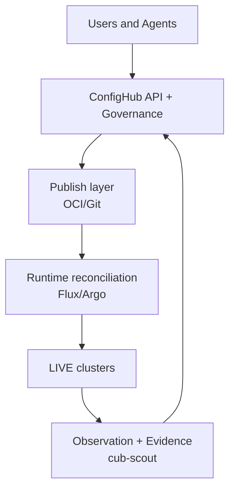
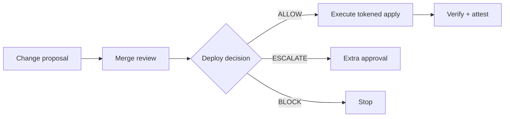
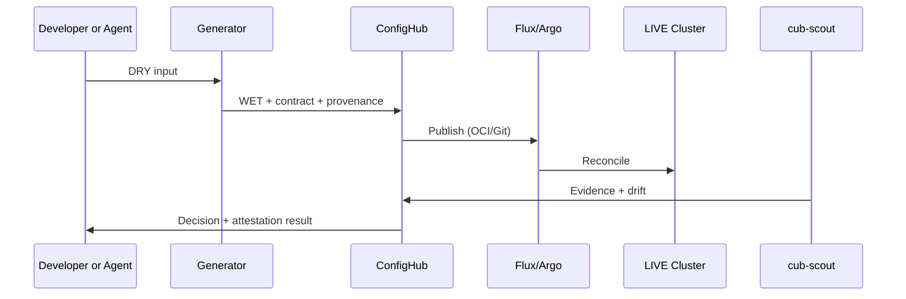

# Demo Illustration Pack

**Purpose:** Ready-to-use visuals for meetings, demos, and docs.

Qualification rule:
Use `Agentic GitOps` only when an active inner reconciliation loop (`WET -> LIVE`) exists via Flux/Argo (or equivalent reconciler). Without that loop, classify the flow as `governed config automation`.

## 1. Layered responsibility diagram

## 2. Decision split (review vs deploy)

## 3. DRY/WET/LIVE lifecycle

## 4. Fast demo overlay script (talk track)

1. Show runtime unchanged (Flux/Argo still reconcile).
2. Show change proposal and decision split.
3. Show one enforcement event (BLOCK or ESCALATE).
4. Show successful ALLOW path with attestation.
5. Show mutation ledger record.

## 5. Reusable slide captions

1. `No controller replacement: runtime stays Flux/Argo.`
2. `From file edits to governed platform API decisions.`
3. `Proof-first operations: verify before success claims.`
4. `One change identity across intent, execution, and outcome.`
