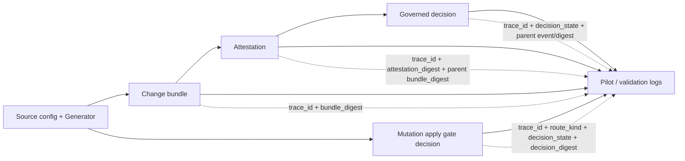

# Proof Events and Traceability

Proof needs to be a record we can log, query, validate, and attest.

In cub-gen, a proof statement is a `proof_event`. It is a small JSON record
embedded in generated artifacts and safe to copy into Pilot logs.

## Why this exists

The human question is still simple:

```text
If this deployed field is wrong, where do I fix it?
```

For Pilot, validation, and attestation, the machine question is stricter:

```text
Which exact artifact made this claim, and how do I join it to the rest of the change?
```

`proof_event/v1` answers that without scraping prose, filenames, or CLI output.

## Event Shape

Every proof event carries:

| Field | Purpose |
|---|---|
| `event_id` | Deterministic id for this proof event |
| `event_type` | What happened, such as `change_bundle.published` |
| `event_time` | RFC3339 timestamp for logs and audit export |
| `trace_id` | Cross-artifact join key; normally the `change_id` |
| `change_id` | Change lifecycle id, when available |
| `artifact_kind` | Artifact being described, such as `change_bundle` or `attestation` |
| `artifact_digest` | Digest of the artifact carrying this event |
| `parent_event_id` | Previous proof event in the chain, when known |
| `parent_artifact_kind` | Parent artifact type, such as `change_bundle` |
| `parent_artifact_digest` | Digest of the parent artifact, such as the bundle an attestation verified |
| `summary_counts` | Small log-friendly counters |
| `generator_profiles` | Generator families involved in the proof |
| `route_kind` | Optional route decision, for mutation apply gate events |
| `owner` | Optional owner for routed mutation decisions |
| `decision_state` | Optional governed decision state, such as `ALLOW` |
| `decision_reason` | Optional short reason for the decision |

Schema: [`proof-event.v1.schema.json`](schemas/proof-event.v1.schema.json)

## Current Event Types

| Event type | Emitted by | Artifact kind | Parent |
|---|---|---|---|
| `change_bundle.published` | `publish` and `platform fanout` | `change_bundle` | none |
| `attestation.verified` | `attest` | `attestation` | `change_bundle.published` |
| `governed_decision.created` | `bridge decision create` | `governed_decision` | bundle digest |
| `governed_decision.attested` | `bridge decision attach` | `governed_decision` | `attestation.verified` |
| `governed_decision.applied` | `bridge decision apply` | `governed_decision` | previous decision event |
| `mutation_apply_gate.evaluated` | `gate mutation` | `mutation_apply_gate` | none |

## CLI Extraction

Use `proof events` when a Pilot, CI, validation, or audit step needs proof
records without carrying the whole bundle payload:

```bash
cub-gen proof events --in bundle.json
cub-gen proof events --in attestation.json --bundle bundle.json --ndjson
cub-gen proof events --in decision.json --ndjson
cub-gen proof events --in mutation-gate-decision.json --ndjson
```

The command verifies the input first. Bundle input is checked with
`verify`; attestation input is checked with `verify-attestation`, and the
optional `--bundle` flag strengthens the parent-link check. Decision input is
checked against the governed decision-state contract and must carry
`proof_events[]`. Mutation gate input is checked against the
`mutation-apply-gate-decision/v1` contract, including the decision digest and
the embedded `mutation_apply_gate.evaluated` event.

## Trace Chain



The important join keys are:

| Join | Fields |
|---|---|
| Change lifecycle | `trace_id`, `change_id` |
| Bundle integrity | `artifact_kind=change_bundle`, `artifact_digest=bundle_digest` |
| Attestation integrity | `artifact_kind=attestation`, `artifact_digest=attestation_digest` |
| Attestation to bundle | `parent_artifact_kind=change_bundle`, `parent_artifact_digest=bundle_digest` |
| Decision lifecycle | `artifact_kind=governed_decision`, `decision_state`, `parent_event_id` |
| Mutation apply gate | `artifact_kind=mutation_apply_gate`, `route_kind`, `decision_state`, `artifact_digest=decision_digest` |

## Digest Rules

Proof events are embedded inside the artifact they describe. To avoid circular
hashing:

1. `artifact_digest` is excluded from the enclosing artifact digest.
2. The enclosing artifact digest is computed.
3. `artifact_digest` is filled with that digest.
4. Verification checks both the artifact digest and the proof-event linkage.

This means normal artifact tampering fails digest verification. Link tampering
inside a proof event fails proof-event verification.

## Example

```json
{
  "schema_version": "cub.confighub.io/proof-event/v1",
  "event_id": "evt_...",
  "event_type": "attestation.verified",
  "event_time": "2026-03-06T10:00:00Z",
  "source": "cub-gen",
  "trace_id": "chg_...",
  "change_id": "chg_...",
  "space": "platform",
  "target_slug": "helm",
  "artifact_kind": "attestation",
  "artifact_digest": "sha256:...",
  "parent_event_id": "evt_...",
  "parent_artifact_kind": "change_bundle",
  "parent_artifact_digest": "sha256:...",
  "summary_counts": {
    "verified_bundles": 1
  }
}
```

## Product Rule

Any feature that claims proof should be able to emit or preserve a
`proof_event/v1` record. If a feature cannot produce a proof event yet, it
should say so in diagnostics instead of pretending the proof chain is complete.
