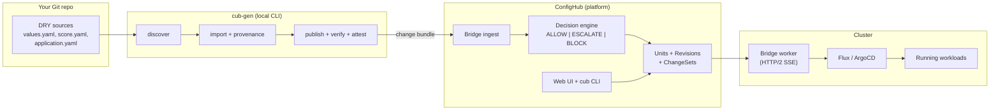

# The ConfigHub Platform

cub-gen is the local-first entry point to the ConfigHub platform.

- Local mode: standalone, no backend login required.
- Connected mode: `cub auth login` + ConfigHub backend APIs.

ConfigHub backend OSS is available today:

- [confighubai/confighub](https://github.com/confighubai/confighub)

---

## Two loops, not a triangle

```
Inner loop (seconds/minutes, automated):
  WET ←→ LIVE    Flux/Argo reconcile continuously

Outer loop (hours/days, human or agent-mediated):
  LIVE → observe → decide → edit DRY → render WET → apply LIVE
```

DRY→WET is a one-way deterministic transform (the generator function). There is no automatic LIVE→DRY path — that would undermine the entire governance model.

But there *is* an outer loop: someone observes a live value, asks "where do I change this?", and cub-gen's inverse-edit map points them back to the right DRY source file and line. A human or agent then edits DRY, the generator re-renders WET, and Flux/Argo apply to LIVE.

The inner loop is what classical GitOps already does well. The outer loop is where teams lose time — and where AI agents compress cycle time dangerously if there is no verification step. cub-gen adds the traceability and governed gating that makes the outer loop safe at speed.

---

## The full picture



**You are here** with cub-gen: the left two boxes. Everything to the right exists and is running in production at ConfigHub.

---

## What each layer does

### cub-gen (this project)

Local CLI that runs against any Git repo. No backend required.

| Command | What it does |
|---------|-------------|
| `gitops discover` | Scans repo, classifies generator roots |
| `gitops import` | Emits DRY/WET classification with provenance and inverse-edit guidance |
| `gitops cleanup` | Removes local discover state |
| `publish` | Produces a deterministic change bundle (JSON envelope with SHA-256 digest) |
| `verify` | Validates bundle schema and digest integrity |
| `attest` | Emits an attestation record from a verified bundle |

The output of `publish` is a **ConfigHub-ready change bundle** — the exact format that ConfigHub's bridge ingest accepts.

### ConfigHub (the platform)

Full production backend: Go server, PostgreSQL, React UI, `cub` CLI.

| Capability | Description |
|-----------|-------------|
| **Spaces** | Organizational containers for units, targets, and workers |
| **Units** | Governed configuration objects with revision history, data, live state |
| **Revisions** | Immutable snapshots with content hashes and apply gates |
| **ChangeSets** | Group revisions between tagged points for review |
| **Apply gates** | Policy gates that must clear before a unit can be applied (trigger-driven) |
| **Targets** | Named deployment destinations (K8s namespace, Flux source, ArgoCD app) |
| **Bridge workers** | Long-lived agents connecting ConfigHub to clusters via HTTP/2 SSE |
| **Functions** | Built-in and worker-hosted operations (set-image, get-replicas, policy checks) |
| **Triggers** | Automated functions that evaluate on mutation (vet-approvedby, vet-celexpr) |

The `cub` CLI manages all of this:

```bash
cub auth login
cub space list
cub unit list --space platform --where "toolchainType = 'helm'"
cub unit apply --space platform my-service --wait
cub worker run --space platform
```

### Bridge workers (cluster agents)

Bridge workers run in your cluster and maintain a persistent HTTP/2 SSE connection back to ConfigHub. They:

- Advertise their capabilities (which provider types and toolchains they support)
- Auto-register available targets on connection
- Poll for queued operations (apply, destroy, refresh, import)
- Execute against the cluster and report results back

Supported provider types:

| Provider | Description |
|----------|-------------|
| `Kubernetes` | Direct kubectl-style apply |
| `FluxOCIWriter` | Writes OCI artifacts for Flux CD |
| `FluxRenderer` | Renders Flux resources |
| `ArgoCDRenderer` | Renders ArgoCD Application resources |
| `ConfigMapRenderer` | Renders Kubernetes ConfigMaps |

### Flux / ArgoCD (reconcilers)

Nothing changes here. Flux and ArgoCD continue to reconcile WET manifests to LIVE cluster state. ConfigHub governs what gets applied and when — the reconcilers do the applying.

---

## The bridge pipeline

This is the path from cub-gen's local output to governed deployment:

```
publish → verify → attest → bridge ingest → decision → promote
  (local, offline)            (requires ConfigHub)
```

### Local phase (cub-gen, no backend)

```bash
# Build a change bundle from your repo
./cub-gen publish --space platform ./examples/helm-paas ./examples/helm-paas > bundle.json

# Verify integrity
./cub-gen verify --in bundle.json

# Emit attestation
./cub-gen attest --in bundle.json --verifier ci-bot > attestation.json
```

These three commands work offline. The bundle and attestation are portable JSON files.

### Connected phase (ConfigHub API)

```bash
# Submit bundle to ConfigHub
BASE_URL="${CONFIGHUB_BASE_URL:-$(cub context get --json | jq -r '.coordinate.serverURL')}"
./cub-gen bridge ingest --in bundle.json --base-url "$BASE_URL" > ingest.json

# Query backend decision state (authoritative)
./cub-gen bridge decision query \
  --base-url "$BASE_URL" \
  --change-id "$(jq -r .change_id bundle.json)" > decision.json

# Promotion flow (app PR → ConfigHub MR → platform DRY PR)
./cub-gen bridge promote init --change-id chg_123 ...
./cub-gen bridge promote govern --flow flow.json --state ALLOW ...
./cub-gen bridge promote verify --flow flow.json
./cub-gen bridge promote open --flow flow.json ...
./cub-gen bridge promote approve --flow flow.json --by platform-owner
./cub-gen bridge promote merge --flow flow.json --by platform-owner
```

Connected demos and CI treat ConfigHub decision query output as the source of truth.
Local `bridge decision create|attach|apply` commands are still available for offline contract simulation.

---

## Adoption path

You don't have to use ConfigHub to use cub-gen. The progression is:

| Stage | What you use | What you get |
|-------|-------------|-------------|
| **0. Local CLI** | `cub-gen` only | DRY/WET classification, provenance, inverse-edit guidance. Works today against any Git repo. |
| **1. Bridge artifacts** | `cub-gen publish + verify + attest` | Portable change bundles with digest verification and attestation. Still local, still offline. |
| **2. ConfigHub connected** | ConfigHub backend + bridge ingest | Governed WET state, decision authority, cross-repo queries, retention, policy at write time. |
| **3. Governed execution** | ConfigHub + bridge workers + Flux/ArgoCD | Full governed pipeline: nothing deploys without an explicit ALLOW decision with attestation linkage. |

Each stage is additive. You keep everything from the previous stage and add new capability.

---

## What you keep if you stop using ConfigHub

Everything authored in Git stays in Git:

- DRY source files (your `values.yaml`, `score.yaml`, `application.yaml`)
- Generator code and templates
- cub-gen provenance output and change bundles
- Attestation records
- Evidence bundles

What you lose is the platform layer:

- Cross-repo configuration queries
- Centralized provenance index
- Policy evaluation at write time
- Compliance exports and retention
- Apply gates and governed decision state
- Web UI and `cub` CLI management

---

## Plain-English collaboration story

A practical app-team/platform-team path in a Spring Boot repo:

1. App team changes `server.port` in `application-prod.yaml` for a feature rollout.
2. Platform team runs `cub-gen gitops import --json` and sees:
   - app-owned DRY inputs (`app-config-base`, `app-config-profile`)
   - platform-owned WET targets (`wet_manifest_targets.owner = platform-runtime`)
   - inverse pointers showing app-editable fields (`spring.application.name`, `server.port`) vs platform-governed field (`spring.datasource.url`)
3. Flux/Argo reconciliation path stays unchanged for deployment.
4. Teams keep app velocity while preserving governance boundaries.

The pattern is the same for Helm, Score.dev, Backstage, AI agents, and operational workflows. Only the adapter changes.

---

## What cub-gen does vs what requires ConfigHub

| Capability | cub-gen (local) | ConfigHub (connected) |
|-----------|----------------|----------------------|
| Generator detection + DRY/WET classification | Yes | Yes |
| Field-origin tracing + inverse-edit guidance | Yes | Yes |
| Evidence bundles (publish, verify, attest) | Yes | Yes |
| Cross-repo queries + policy enforcement | -- | Yes |
| Governed decisions (ALLOW/ESCALATE/BLOCK) | -- | Yes |
| Bridge workers + cluster integration | -- | Yes |

cub-gen is designed to be useful on its own. You get full traceability without a backend. ConfigHub adds the governance layer when you need it.

---

## Links

- [ConfigHub](https://github.com/confighubai/confighub) — the platform
- [Getting Started](getting-started.md) — try cub-gen locally in 10 minutes
- [CLI Reference](cli-reference.md) — full command documentation including bridge flow
- [Adoption Path & FAQ](agentic-gitops/05-rollout/40-adoption-and-reference.md) — progressive adoption ladder with pricing boundary
