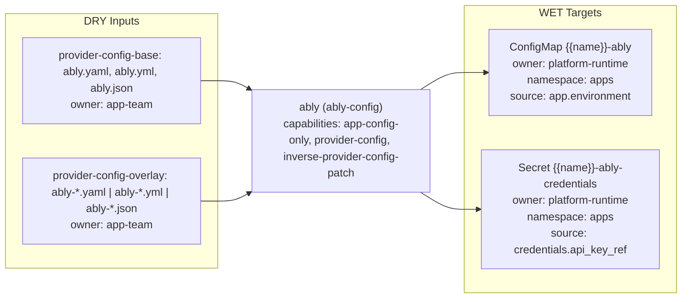

# ably Triple

- Profile: `ably-config`
- Resource: `ConfigMap` (`v1/ConfigMap`)
- Capabilities: app-config-only, provider-config, inverse-provider-config-patch

## Contract

- Default input role: `provider-config`
- Default owner: `app-team`

### Input role rules

| Role | Exact basenames | Prefixes | Extensions |
| --- | --- | --- | --- |
| `provider-config-base` | ably.yaml, ably.yml, ably.json | - | - |
| `provider-config-overlay` | - | ably- | .yaml, .yml, .json |

### Role owners

| Role | Owner |
| --- | --- |

### Role schema refs

| Role | Schema ref |
| --- | --- |
| `provider-config-base` | `https://schema.confighub.dev/generators/ably-config-v1` |
| `provider-config-overlay` | `https://schema.confighub.dev/generators/ably-config-v1` |

### WET targets

| Kind | Name template | Owner | Namespace | Source DRY path template |
| --- | --- | --- | --- | --- |
| `ConfigMap` | `{{name}}-ably` | `platform-runtime` | `apps` | `app.environment` |
| `Secret` | `{{name}}-ably-credentials` | `platform-runtime` | `apps` | `credentials.api_key_ref` |

## Provenance

- Field-origin transform: `ably-config-to-runtime`
- Field-origin overlay transform: `ably-overlay-merge`

### Field-origin confidences

| Key | Confidence |
| --- | --- |
| `channels_base` | 0.88 |
| `channels_overlay` | 0.84 |
| `environment` | 0.90 |

### Rendered lineage templates

| Kind | Name template | Namespace | Source path hint | Hint fallback | Multi hint | Source DRY path template | Optional |
| --- | --- | --- | --- | --- | --- | --- | --- |
| `ConfigMap` | `{{name}}-ably` | `apps` | `base_config_path` | `` | `false` | `app.environment` | `false` |
| `Secret` | `{{name}}-ably-credentials` | `apps` | `base_config_path` | `` | `false` | `credentials.api_key_ref` | `false` |
| `ConfigMap` | `{{name}}-ably` | `apps` | `overlay_config_path` | `` | `false` | `channels.inbound` | `true` |

## Inverse

### Inverse patch templates

| Key | Editable by | Confidence | Requires review |
| --- | --- | --- | --- |
| `channels` | `app-team` | 0.88 | `false` |
| `environment` | `app-team` | 0.90 | `false` |

### Inverse pointer templates

| Key | Owner | Confidence |
| --- | --- | --- |
| `channels` | `app-team` | 0.88 |
| `environment` | `app-team` | 0.90 |

### Inverse patch reasons

| Key | Reason |
| --- | --- |
| `channels` | Channel mapping is app-level runtime behavior. |
| `environment` | Environment is sourced from {{base_config_path}}. |

### Inverse edit hints

| Key | Hint |
| --- | --- |
| `channels_base` | Edit channels.inbound in {{base_config_path}}. |
| `channels_overlay` | Edit channels.inbound in {{overlay_config_path}} for environment-specific behavior; use {{base_config_path}} for defaults. |
| `environment` | Edit app.environment in {{base_config_path}}. |

### Hint defaults

| Key | Value |
| --- | --- |
| `base_config_path` | `ably.yaml` |
