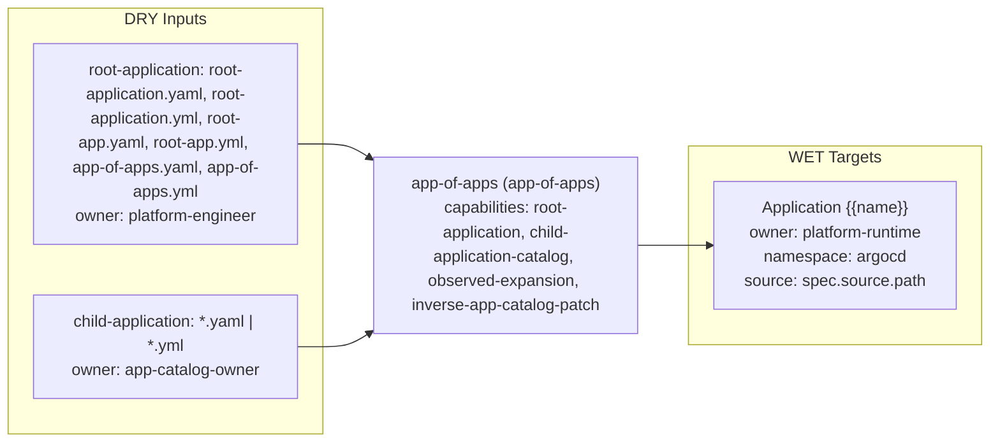

# app-of-apps Triple

- Profile: `app-of-apps`
- Resource: `Application` (`argoproj.io/v1alpha1/Application`)
- Capabilities: root-application, child-application-catalog, observed-expansion, inverse-app-catalog-patch

## Contract

- Default input role: `argo-application`
- Default owner: `app-catalog-owner`

### Input role rules

| Role | Exact basenames | Path prefixes | Prefixes | Extensions |
| --- | --- | --- | --- | --- |
| `root-application` | root-application.yaml, root-application.yml, root-app.yaml, root-app.yml, app-of-apps.yaml, app-of-apps.yml | - | - | - |
| `child-application` | - | apps/, applications/ | - | .yaml, .yml |

### Role owners

| Role | Owner |
| --- | --- |
| `child-application` | `app-catalog-owner` |
| `root-application` | `platform-engineer` |

### Role schema refs

| Role | Schema ref |
| --- | --- |
| `child-application` | `https://schema.confighub.dev/generators/app-of-apps-child-v1` |
| `root-application` | `https://schema.confighub.dev/generators/app-of-apps-root-v1` |

### WET targets

| Kind | Name template | Owner | Namespace | Source DRY path template |
| --- | --- | --- | --- | --- |
| `Application` | `{{name}}` | `platform-runtime` | `argocd` | `spec.source.path` |

## Provenance

- Field-origin transform: `app-of-apps-catalog`
- Field-origin overlay transform: `app-of-apps-root-expansion`

### Field-origin confidences

| Key | Confidence |
| --- | --- |
| `child_name` | 0.92 |
| `root_path` | 0.88 |
| `source_path` | 0.90 |
| `source_repo` | 0.90 |

### Rendered lineage templates

| Kind | Name template | Namespace | Source path hint | Hint fallback | Multi hint | Source DRY path template | Optional |
| --- | --- | --- | --- | --- | --- | --- | --- |
| `Application` | `{{name}}` | `argocd` | `root_application_path` | `` | `false` | `spec.source.path` | `false` |

## Inverse

### Inverse patch templates

| Key | Editable by | Confidence | Requires review |
| --- | --- | --- | --- |
| `child_name` | `app-catalog-owner` | 0.92 | `false` |
| `root_path` | `platform-engineer` | 0.88 | `true` |
| `source_path` | `app-catalog-owner` | 0.90 | `true` |
| `source_repo` | `app-catalog-owner` | 0.90 | `true` |

### Inverse pointer templates

| Key | Owner | Confidence |
| --- | --- | --- |
| `child_name` | `app-catalog-owner` | 0.92 |
| `root_path` | `platform-engineer` | 0.88 |
| `source_path` | `app-catalog-owner` | 0.90 |
| `source_repo` | `app-catalog-owner` | 0.90 |

### Inverse patch reasons

| Key | Reason |
| --- | --- |
| `child_name` | Child Application identity is owned by the child app catalog. |
| `root_path` | The root Application controls which catalog path is expanded. |
| `source_path` | Child Application source path is selected by the child app catalog. |
| `source_repo` | Child Application repo URL is selected by the child app catalog. |

### Inverse edit hints

| Key | Hint |
| --- | --- |
| `child_name` | Route: apply-here. Edit metadata.name in {{child_application_path}}. |
| `root_path` | Route: lift-upstream. Edit spec.source.path in {{root_application_path}} to change the child app catalog. |
| `source_path` | Route: apply-here. Edit spec.source.path in {{child_application_path}}. |
| `source_repo` | Route: apply-here. Edit spec.source.repoURL in {{child_application_path}}. |

### Hint defaults

| Key | Value |
| --- | --- |
| `child_catalog_path` | `apps` |
| `root_application_path` | `root-application.yaml` |
