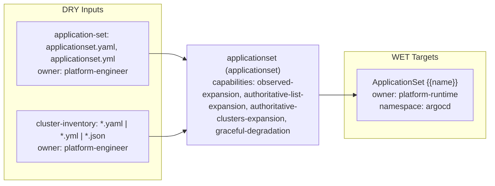

# applicationset Triple

- Profile: `applicationset`
- Resource: `ApplicationSet` (`argoproj.io/v1alpha1/ApplicationSet`)
- Capabilities: observed-expansion, authoritative-list-expansion, authoritative-clusters-expansion, graceful-degradation

## Contract

- Default input role: `applicationset-input`
- Default owner: `platform-engineer`

### Input role rules

| Role | Exact basenames | Path prefixes | Prefixes | Extensions |
| --- | --- | --- | --- | --- |
| `application-set` | applicationset.yaml, applicationset.yml | - | - | - |
| `cluster-inventory` | - | clusters/, inventory/clusters/, platform/clusters/ | - | .yaml, .yml, .json |

### Role owners

| Role | Owner |
| --- | --- |
| `application-set` | `platform-engineer` |
| `cluster-inventory` | `platform-engineer` |

### Role schema refs

| Role | Schema ref |
| --- | --- |
| `application-set` | `https://schema.confighub.dev/generators/applicationset-v1` |
| `cluster-inventory` | `https://schema.confighub.dev/generators/cluster-inventory-v1` |

### WET targets

| Kind | Name template | Owner | Namespace | Source DRY path template |
| --- | --- | --- | --- | --- |
| `ApplicationSet` | `{{name}}` | `platform-runtime` | `argocd` | `` |

## Provenance

- Field-origin transform: `applicationset-template`
- Field-origin overlay transform: ``

### Field-origin confidences

| Key | Confidence |
| --- | --- |
| `child_name` | 0.89 |
| `source_path` | 0.86 |

### Rendered lineage templates

| Kind | Name template | Namespace | Source path hint | Hint fallback | Multi hint | Source DRY path template | Optional |
| --- | --- | --- | --- | --- | --- | --- | --- |
| `ApplicationSet` | `{{name}}` | `argocd` | `application_set_path` | `` | `false` | `spec` | `false` |

## Inverse

### Inverse patch templates

| Key | Editable by | Confidence | Requires review |
| --- | --- | --- | --- |
| `child_name` | `platform-engineer` | 0.89 | `false` |
| `source_path` | `platform-engineer` | 0.86 | `true` |

### Inverse pointer templates

| Key | Owner | Confidence |
| --- | --- | --- |
| `child_name` | `platform-engineer` | 0.89 |
| `source_path` | `platform-engineer` | 0.86 |

### Inverse patch reasons

| Key | Reason |
| --- | --- |
| `child_name` | Child Application identity is generated from the parent ApplicationSet template. |
| `source_path` | Child Application source path is generated from the parent ApplicationSet template. |

### Inverse edit hints

| Key | Hint |
| --- | --- |
| `child_name` | Edit spec.template.metadata.name in {{application_set_path}}. |
| `source_path` | Edit spec.template.spec.source.path in {{application_set_path}}. |

### Hint defaults

| Key | Value |
| --- | --- |
| `application_set_path` | `applicationset.yaml` |
