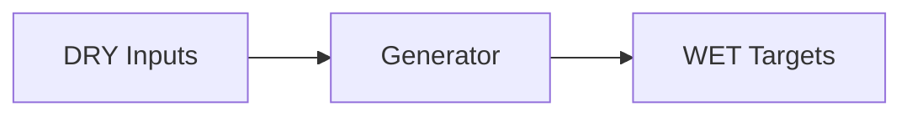

# backstage Triple

- Profile: `backstage-idp`
- Resource: `Component` (`backstage.io/v1alpha1/Component`)
- Capabilities: catalog-metadata, render-manifests, inverse-catalog-patch

## Contract

- Default input role: `backstage-input`
- Default owner: `platform-engineer`

### Input role rules

| Role | Exact basenames | Prefixes | Extensions |
| --- | --- | --- | --- |
| `catalog-spec` | catalog-info.yaml, catalog-info.yml | - | - |
| `app-config` | app-config.yaml, app-config.yml | - | - |

### Role owners

| Role | Owner |
| --- | --- |
| `app-config` | `app-team` |

### Role schema refs

| Role | Schema ref |
| --- | --- |
| `app-config` | `https://json.schemastore.org/backstage-app-config` |
| `catalog-spec` | `https://json.schemastore.org/backstage-catalog-info` |

### WET targets

| Kind | Name template | Owner | Namespace | Source DRY path template |
| --- | --- | --- | --- | --- |
| `Application` | `{{name}}` | `platform-runtime` | `apps` | `metadata.name` |
| `ConfigMap` | `{{name}}-catalog` | `platform-runtime` | `apps` | `spec.lifecycle` |

## Provenance

- Field-origin transform: `backstage-component-to-application`
- Field-origin overlay transform: ``

### Field-origin confidences

| Key | Confidence |
| --- | --- |
| `identity` | 0.90 |
| `lifecycle` | 0.82 |

### Rendered lineage templates

| Kind | Name template | Namespace | Source path hint | Hint fallback | Multi hint | Source DRY path template | Optional |
| --- | --- | --- | --- | --- | --- | --- | --- |
| `Application` | `{{name}}` | `apps` | `catalog_path` | `` | `false` | `metadata.name` | `false` |
| `ConfigMap` | `{{name}}-catalog` | `apps` | `catalog_path` | `` | `false` | `spec.lifecycle` | `false` |

## Inverse

### Inverse patch templates

| Key | Editable by | Confidence | Requires review |
| --- | --- | --- | --- |
| `identity` | `platform-engineer` | 0.87 | `false` |
| `lifecycle` | `platform-engineer` | 0.82 | `true` |

### Inverse pointer templates

| Key | Owner | Confidence |
| --- | --- | --- |
| `lifecycle` | `platform-engineer` | 0.82 |
| `name` | `platform-engineer` | 0.90 |

### Inverse patch reasons

| Key | Reason |
| --- | --- |
| `identity` | Backstage component identity is sourced from {{catalog_path}}. |
| `lifecycle` | Lifecycle changes impact platform ownership and support policy. |

### Inverse edit hints

| Key | Hint |
| --- | --- |
| `lifecycle` | Edit spec.lifecycle in {{catalog_path}} and coordinate rollout policy. |
| `name` | Edit metadata.name in {{catalog_path}}. |

### Hint defaults

| Key | Value |
| --- | --- |
| `catalog_path` | `catalog-info.yaml` |
