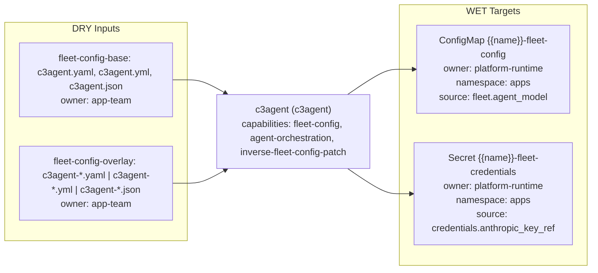

# c3agent Triple

- Profile: `c3agent`
- Resource: `ConfigMap` (`v1/ConfigMap`)
- Capabilities: fleet-config, agent-orchestration, inverse-fleet-config-patch

## Contract

- Default input role: `fleet-config`
- Default owner: `app-team`

### Input role rules

| Role | Exact basenames | Prefixes | Extensions |
| --- | --- | --- | --- |
| `fleet-config-base` | c3agent.yaml, c3agent.yml, c3agent.json | - | - |
| `fleet-config-overlay` | - | c3agent- | .yaml, .yml, .json |

### Role owners

| Role | Owner |
| --- | --- |

### Role schema refs

| Role | Schema ref |
| --- | --- |
| `fleet-config-base` | `https://schema.confighub.dev/generators/c3agent-v1` |
| `fleet-config-overlay` | `https://schema.confighub.dev/generators/c3agent-v1` |

### WET targets

| Kind | Name template | Owner | Namespace | Source DRY path template |
| --- | --- | --- | --- | --- |
| `ConfigMap` | `{{name}}-fleet-config` | `platform-runtime` | `apps` | `fleet.agent_model` |
| `Secret` | `{{name}}-fleet-credentials` | `platform-runtime` | `apps` | `credentials.anthropic_key_ref` |

## Provenance

- Field-origin transform: `c3agent-config-to-runtime`
- Field-origin overlay transform: `c3agent-overlay-merge`

### Field-origin confidences

| Key | Confidence |
| --- | --- |
| `component_ports_base` | 0.84 |
| `component_ports_overlay` | 0.80 |
| `credentials` | 0.86 |
| `fleet_config` | 0.91 |

### Rendered lineage templates

| Kind | Name template | Namespace | Source path hint | Hint fallback | Multi hint | Source DRY path template | Optional |
| --- | --- | --- | --- | --- | --- | --- | --- |
| `ConfigMap` | `{{name}}-fleet-config` | `apps` | `base_config_path` | `` | `false` | `fleet.agent_model` | `false` |
| `Secret` | `{{name}}-fleet-credentials` | `apps` | `base_config_path` | `` | `false` | `credentials.anthropic_key_ref` | `false` |
| `ConfigMap` | `{{name}}-fleet-config` | `apps` | `overlay_config_path` | `` | `false` | `fleet.max_concurrent_tasks` | `true` |

## Inverse

### Inverse patch templates

| Key | Editable by | Confidence | Requires review |
| --- | --- | --- | --- |
| `component_ports` | `platform-engineer` | 0.84 | `true` |
| `credentials` | `platform-engineer` | 0.86 | `true` |
| `fleet_config` | `app-team` | 0.91 | `false` |

### Inverse pointer templates

| Key | Owner | Confidence |
| --- | --- | --- |
| `component_ports` | `platform-engineer` | 0.84 |
| `credentials` | `platform-engineer` | 0.86 |
| `fleet_config` | `app-team` | 0.91 |

### Inverse patch reasons

| Key | Reason |
| --- | --- |
| `component_ports` | Component port changes affect platform networking and service mesh. |
| `credentials` | Credential references impact platform secret management. |
| `fleet_config` | Fleet configuration (model, concurrency) is sourced from {{base_config_path}}. |

### Inverse edit hints

| Key | Hint |
| --- | --- |
| `component_ports_base` | Edit components.controlplane.grpc_port in {{base_config_path}}. |
| `component_ports_overlay` | Edit component ports in {{overlay_config_path}} for environment-specific values; use {{base_config_path}} for defaults. |
| `credentials` | Edit credentials section in {{base_config_path}} and coordinate with platform secret management. |
| `fleet_config` | Edit fleet.agent_model or fleet.max_concurrent_tasks in {{base_config_path}}. |

### Hint defaults

| Key | Value |
| --- | --- |
| `base_config_path` | `c3agent.yaml` |
