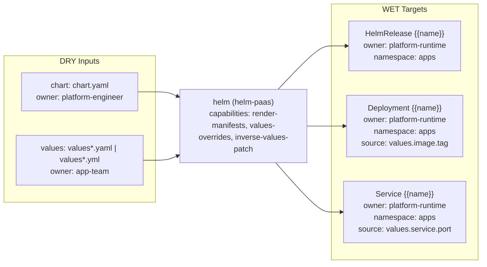

# helm Triple

- Profile: `helm-paas`
- Resource: `HelmRelease` (`helm.toolkit.fluxcd.io/v2/HelmRelease`)
- Capabilities: render-manifests, values-overrides, inverse-values-patch

## Contract

- Default input role: `helm-input`
- Default owner: `platform-engineer`

### Input role rules

| Role | Exact basenames | Prefixes | Extensions |
| --- | --- | --- | --- |
| `chart` | chart.yaml | - | - |
| `values` | - | values | .yaml, .yml |

### Role owners

| Role | Owner |
| --- | --- |
| `values` | `app-team` |

### Role schema refs

| Role | Schema ref |
| --- | --- |
| `chart` | `https://json.schemastore.org/chart` |

### WET targets

| Kind | Name template | Owner | Namespace | Source DRY path template |
| --- | --- | --- | --- | --- |
| `HelmRelease` | `{{name}}` | `platform-runtime` | `apps` | `` |
| `Deployment` | `{{name}}` | `platform-runtime` | `apps` | `values.image.tag` |
| `Service` | `{{name}}` | `platform-runtime` | `apps` | `values.service.port` |

## Provenance

- Field-origin transform: `helm-template`
- Field-origin overlay transform: ``

### Field-origin confidences

| Key | Confidence |
| --- | --- |
| `image_tag` | 0.86 |

### Rendered lineage templates

| Kind | Name template | Namespace | Source path hint | Hint fallback | Multi hint | Source DRY path template | Optional |
| --- | --- | --- | --- | --- | --- | --- | --- |
| `HelmRelease` | `{{name}}` | `apps` | `chart_path` | `` | `false` | `Chart.yaml` | `false` |
| `Deployment` | `{{name}}` | `apps` | `values_paths` | `chart_path` | `true` | `values.image.tag` | `false` |
| `Service` | `{{name}}` | `apps` | `values_paths` | `chart_path` | `true` | `values.service.port` | `false` |

## Inverse

### Inverse patch templates

| Key | Editable by | Confidence | Requires review |
| --- | --- | --- | --- |
| `image_tag` | `app-team` | 0.86 | `false` |

### Inverse pointer templates

| Key | Owner | Confidence |
| --- | --- | --- |
| `image_tag` | `app-team` | 0.86 |

### Inverse patch reasons

| Key | Reason |
| --- | --- |
| `image_tag` | Container image tag maps cleanly to helm values. |

### Inverse edit hints

| Key | Hint |
| --- | --- |
| `image_tag` | Edit chart values file and keep chart template unchanged. |

### Hint defaults

| Key | Value |
| --- | --- |
| `chart_path` | `Chart.yaml` |
| `chart_role` | `chart` |
| `primary_values_path` | `values.yaml` |
| `values_role` | `values` |
