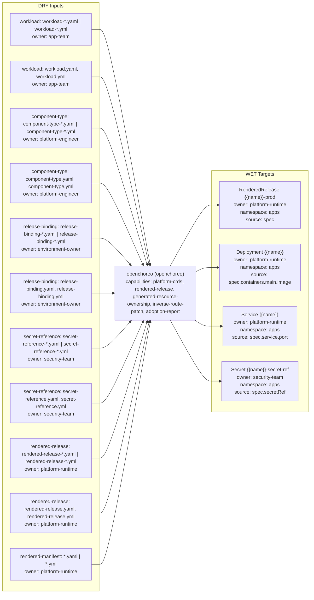

# openchoreo Triple

- Profile: `openchoreo`
- Resource: `Workload` (`openchoreo.dev/v1alpha1/Workload`)
- Capabilities: platform-crds, rendered-release, generated-resource-ownership, inverse-route-patch, adoption-report

## Contract

- Default input role: `openchoreo-input`
- Default owner: `platform-engineer`

### Input role rules

| Role | Exact basenames | Path prefixes | Prefixes | Extensions |
| --- | --- | --- | --- | --- |
| `workload` | - | - | workload- | .yaml, .yml |
| `workload` | workload.yaml, workload.yml | - | - | - |
| `component-type` | - | - | component-type- | .yaml, .yml |
| `component-type` | component-type.yaml, component-type.yml | - | - | - |
| `release-binding` | - | - | release-binding- | .yaml, .yml |
| `release-binding` | release-binding.yaml, release-binding.yml | - | - | - |
| `secret-reference` | - | - | secret-reference- | .yaml, .yml |
| `secret-reference` | secret-reference.yaml, secret-reference.yml | - | - | - |
| `rendered-release` | - | - | rendered-release- | .yaml, .yml |
| `rendered-release` | rendered-release.yaml, rendered-release.yml | - | - | - |
| `rendered-manifest` | - | rendered/ | - | .yaml, .yml |

### Role owners

| Role | Owner |
| --- | --- |
| `component-type` | `platform-engineer` |
| `release-binding` | `environment-owner` |
| `rendered-manifest` | `platform-runtime` |
| `rendered-release` | `platform-runtime` |
| `secret-reference` | `security-team` |
| `workload` | `app-team` |

### Role schema refs

| Role | Schema ref |
| --- | --- |
| `component-type` | `https://schema.confighub.dev/generators/openchoreo-component-type-v1` |
| `release-binding` | `https://schema.confighub.dev/generators/openchoreo-release-binding-v1` |
| `rendered-manifest` | `https://schema.confighub.dev/kubernetes/resource-v1` |
| `rendered-release` | `https://schema.confighub.dev/generators/openchoreo-rendered-release-v1` |
| `secret-reference` | `https://schema.confighub.dev/generators/openchoreo-secret-reference-v1` |
| `workload` | `https://schema.confighub.dev/generators/openchoreo-workload-v1` |

### WET targets

| Kind | Name template | Owner | Namespace | Source DRY path template |
| --- | --- | --- | --- | --- |
| `RenderedRelease` | `{{name}}-prod` | `platform-runtime` | `apps` | `spec` |
| `Deployment` | `{{name}}` | `platform-runtime` | `apps` | `spec.containers.main.image` |
| `Service` | `{{name}}` | `platform-runtime` | `apps` | `spec.service.port` |
| `Secret` | `{{name}}-secret-ref` | `security-team` | `apps` | `spec.secretRef` |

## Provenance

- Field-origin transform: `openchoreo-release-render`
- Field-origin overlay transform: `openchoreo-environment-binding`

### Field-origin confidences

| Key | Confidence |
| --- | --- |
| `env_var` | 0.84 |
| `image` | 0.88 |
| `platform_default` | 0.78 |
| `resource_limit` | 0.80 |
| `secret_ref` | 0.86 |
| `service_port` | 0.82 |

### Rendered lineage templates

| Kind | Name template | Namespace | Source path hint | Hint fallback | Multi hint | Source DRY path template | Optional |
| --- | --- | --- | --- | --- | --- | --- | --- |
| `RenderedRelease` | `{{name}}-prod` | `apps` | `rendered_release_path` | `` | `false` | `spec` | `false` |
| `Deployment` | `{{name}}` | `apps` | `workload_path` | `` | `false` | `spec.containers.main.image` | `false` |
| `Deployment` | `{{name}}` | `apps` | `release_binding_path` | `` | `false` | `spec.environment.env.LOG_LEVEL` | `false` |
| `Deployment` | `{{name}}` | `apps` | `secret_reference_path` | `` | `false` | `spec.secretRef` | `false` |
| `Service` | `{{name}}` | `apps` | `component_type_path` | `` | `false` | `spec.service.port` | `false` |

## Inverse

### Inverse patch templates

| Key | Editable by | Confidence | Requires review |
| --- | --- | --- | --- |
| `env_var` | `environment-owner` | 0.84 | `false` |
| `image` | `app-team` | 0.88 | `false` |
| `platform_default` | `platform-engineer` | 0.78 | `true` |
| `resource_limit` | `platform-engineer` | 0.80 | `true` |
| `secret_ref` | `security-team` | 0.86 | `true` |
| `service_port` | `platform-engineer` | 0.82 | `true` |

### Inverse pointer templates

| Key | Owner | Confidence |
| --- | --- | --- |
| `env_var` | `environment-owner` | 0.84 |
| `image` | `app-team` | 0.88 |
| `platform_default` | `platform-engineer` | 0.78 |
| `resource_limit` | `platform-engineer` | 0.80 |
| `secret_ref` | `security-team` | 0.86 |
| `service_port` | `platform-engineer` | 0.82 |

### Inverse patch reasons

| Key | Reason |
| --- | --- |
| `env_var` | Environment values flow through the environment/release binding. |
| `image` | Container image is app-owned Workload intent. |
| `platform_default` | Platform defaults are owned by the ComponentType or platform policy, not generated Deployment YAML. |
| `resource_limit` | Resource limits are environment/platform-owned policy defaults. |
| `secret_ref` | Secret references are security-owned bindings and should not be edited on generated resources. |
| `service_port` | Service port is constrained by the ComponentType platform contract. |

### Inverse edit hints

| Key | Hint |
| --- | --- |
| `env_var` | Route: apply-here. Edit environment binding data in {{release_binding_path}}. |
| `image` | Route: lift-upstream. Edit spec.containers.main.image in {{workload_path}}. |
| `platform_default` | Route: block/escalate. Edit the platform default in {{component_type_path}} or platform policy, not the generated Deployment. |
| `resource_limit` | Route: overlay. Keep this as an environment/platform overlay in {{release_binding_path}} or policy. |
| `secret_ref` | Route: block/escalate. Edit {{secret_reference_path}} through the security-owned secret flow. |
| `service_port` | Route: lift-upstream. Edit the service port contract in {{component_type_path}}. |

### Hint defaults

| Key | Value |
| --- | --- |
| `component_type_path` | `component-type.yaml` |
| `release_binding_path` | `release-binding.yaml` |
| `rendered_manifest_path` | `rendered/deployment.yaml` |
| `rendered_release_path` | `rendered-release.yaml` |
| `secret_reference_path` | `secret-reference.yaml` |
| `workload_path` | `workload.yaml` |
