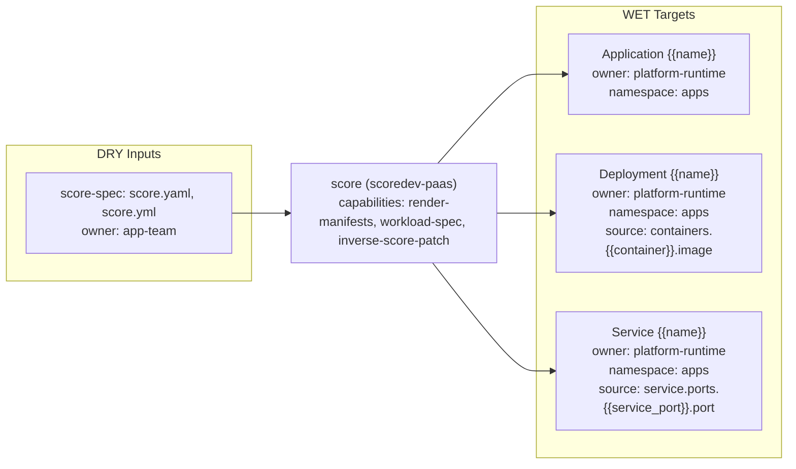

# score Triple

- Profile: `scoredev-paas`
- Resource: `Application` (`argoproj.io/v1alpha1/Application`)
- Capabilities: render-manifests, workload-spec, inverse-score-patch

## Contract

- Default input role: `score-input`
- Default owner: `app-team`

### Input role rules

| Role | Exact basenames | Prefixes | Extensions |
| --- | --- | --- | --- |
| `score-spec` | score.yaml, score.yml | - | - |

### Role owners

| Role | Owner |
| --- | --- |

### Role schema refs

| Role | Schema ref |
| --- | --- |
| `score-spec` | `https://docs.score.dev/schemas/score-v1b1.json` |

### WET targets

| Kind | Name template | Owner | Namespace | Source DRY path template |
| --- | --- | --- | --- | --- |
| `Application` | `{{name}}` | `platform-runtime` | `apps` | `` |
| `Deployment` | `{{name}}` | `platform-runtime` | `apps` | `containers.{{container}}.image` |
| `Service` | `{{name}}` | `platform-runtime` | `apps` | `service.ports.{{service_port}}.port` |

## Provenance

- Field-origin transform: `score-to-k8s`
- Field-origin overlay transform: ``

### Field-origin confidences

| Key | Confidence |
| --- | --- |
| `env_var` | 0.90 |
| `image` | 0.94 |
| `port` | 0.91 |

### Rendered lineage templates

| Kind | Name template | Namespace | Source path hint | Hint fallback | Multi hint | Source DRY path template | Optional |
| --- | --- | --- | --- | --- | --- | --- | --- |
| `Application` | `{{name}}` | `apps` | `source_path` | `` | `false` | `metadata.name` | `false` |
| `Deployment` | `{{name}}` | `apps` | `source_path` | `` | `false` | `containers.{{container_name}}.image` | `false` |
| `Service` | `{{name}}` | `apps` | `source_path` | `` | `false` | `service.ports.{{service_port_name}}.port` | `false` |

## Inverse

### Inverse patch templates

| Key | Editable by | Confidence | Requires review |
| --- | --- | --- | --- |
| `env_var` | `app-team` | 0.90 | `false` |

### Inverse pointer templates

| Key | Owner | Confidence |
| --- | --- | --- |
| `env_var` | `app-team` | 0.90 |
| `image` | `app-team` | 0.94 |
| `port` | `app-team` | 0.91 |

### Inverse patch reasons

| Key | Reason |
| --- | --- |
| `env_var` | Score variable maps to a single Kubernetes env var. |

### Inverse edit hints

| Key | Hint |
| --- | --- |
| `env_var` | Edit {{variable_name}} under containers.{{container_name}}.variables in {{source_path}}. |
| `image` | Edit the Score container image in {{source_path}}. |
| `port` | Edit {{service_port_name}} service port in {{source_path}}. |

### Hint defaults

| Key | Value |
| --- | --- |
| `container_name` | `main` |
| `service_port_name` | `web` |
| `source_path` | `score.yaml` |
| `variable_name` | `LOG_LEVEL` |
