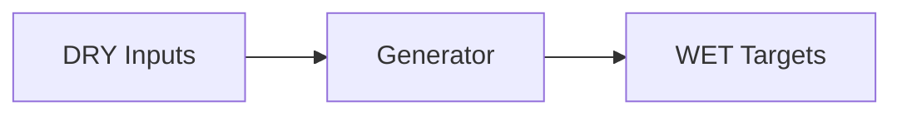

# springboot Triple

- Profile: `springboot-paas`
- Resource: `Kustomization` (`kustomize.toolkit.fluxcd.io/v1/Kustomization`)
- Capabilities: render-app-config, profile-overrides, inverse-app-config-patch

## Contract

- Default input role: `spring-input`
- Default owner: `platform-engineer`

### Input role rules

| Role | Exact basenames | Prefixes | Extensions |
| --- | --- | --- | --- |
| `build-config` | pom.xml, build.gradle, build.gradle.kts | - | - |
| `app-config-base` | application.yaml, application.yml | - | - |
| `app-config-profile` | - | application- | .yaml, .yml |

### Role owners

| Role | Owner |
| --- | --- |
| `app-config-base` | `app-team` |
| `app-config-profile` | `app-team` |

### Role schema refs

| Role | Schema ref |
| --- | --- |
| `app-config-base` | `https://json.schemastore.org/spring-configuration-metadata` |
| `app-config-profile` | `https://json.schemastore.org/spring-configuration-metadata` |

### WET targets

| Kind | Name template | Owner | Namespace | Source DRY path template |
| --- | --- | --- | --- | --- |
| `Kustomization` | `{{name}}` | `platform-runtime` | `apps` | `` |
| `Deployment` | `{{name}}` | `platform-runtime` | `apps` | `server.port` |
| `ConfigMap` | `{{name}}-config` | `platform-runtime` | `apps` | `spring.datasource.url` |

## Provenance

- Field-origin transform: `spring-config-to-manifest`
- Field-origin overlay transform: `spring-profile-overlay`

### Field-origin confidences

| Key | Confidence |
| --- | --- |
| `app_name` | 0.89 |
| `datasource_url` | 0.78 |
| `server_port_base` | 0.92 |
| `server_port_overlay` | 0.88 |

### Rendered lineage templates

| Kind | Name template | Namespace | Source path hint | Hint fallback | Multi hint | Source DRY path template | Optional |
| --- | --- | --- | --- | --- | --- | --- | --- |
| `Kustomization` | `{{name}}` | `apps` | `build_config_path` | `` | `false` | `build` | `false` |
| `Deployment` | `{{name}}` | `apps` | `base_config_path` | `` | `false` | `spring.application.name` | `false` |
| `ConfigMap` | `{{name}}-config` | `apps` | `base_config_path` | `` | `false` | `spring.datasource.url` | `false` |
| `Deployment` | `{{name}}` | `apps` | `profile_config_path` | `base_config_path` | `false` | `server.port` | `false` |

## Inverse

### Inverse patch templates

| Key | Editable by | Confidence | Requires review |
| --- | --- | --- | --- |
| `app_name` | `app-team` | 0.88 | `false` |
| `datasource_url` | `platform-engineer` | 0.78 | `true` |
| `server_port` | `app-team` | 0.91 | `false` |

### Inverse pointer templates

| Key | Owner | Confidence |
| --- | --- | --- |
| `app_name` | `app-team` | 0.89 |
| `datasource_url` | `platform-engineer` | 0.78 |
| `server_port` | `app-team` | 0.91 |

### Inverse patch reasons

| Key | Reason |
| --- | --- |
| `app_name` | Application identity should be app-editable without platform escalation. |
| `datasource_url` | Database connectivity impacts shared runtime dependencies. |
| `server_port` | Application listener port is an app-level configuration concern. |

### Inverse edit hints

| Key | Hint |
| --- | --- |
| `app_name` | Edit spring.application.name in {{base_config_path}}. |
| `datasource_url` | Edit spring.datasource.url in {{base_config_path}} and coordinate with platform ownership rules. |
| `server_port_base` | Edit server.port in {{base_config_path}}. |
| `server_port_overlay` | Edit server.port in {{profile_config_path}} for environment overrides; use {{base_config_path}} for the default. |

### Hint defaults

| Key | Value |
| --- | --- |
| `base_config_path` | `src/main/resources/application.yaml` |
| `build_config_path` | `pom.xml` |
