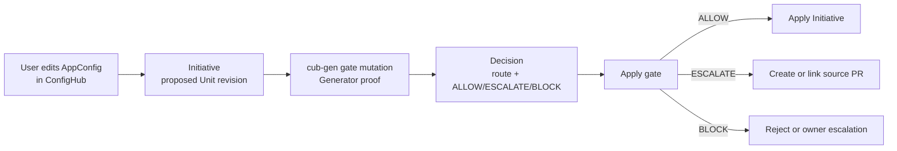

# ConfigHub Initiative GUI Example

This is the Spring example to show in the ConfigHub UI.

The screen is simple: a user proposes an AppConfig edit in an Initiative, and
ConfigHub shows the cub-gen mutation apply gate beside the edited field.

```text
If this deployed field is wrong, where do I fix it?
```

## Current ConfigHub Mapping

The current public `cub` CLI exposes ChangeSets, Unit revisions, Functions,
Triggers, and Apply Gates. The GUI can present the review object as an
Initiative, while the runnable CLI path uses those current primitives.

| GUI term | Current CLI/API backing | What cub-gen adds |
|---|---|---|
| Initiative | ChangeSet plus proposed Unit revisions | Change ID, route decision, proof digest |
| Edited AppConfig field | Unit data / mutation | Field origin and source file |
| Apply gate | Trigger or validation result stored in `ApplyGates` | `MutationApplyGateDecision` |
| Review result | approve/apply or revise | next action: apply here, lift upstream, or block |

## One Screen



The Initiative should show five panels:

| Panel | Content |
|---|---|
| Change | Unit, field path, old value, new value |
| Generator proof | Component, Variant, Target, Generator, source file, source field |
| Mutation apply gate | route, decision, owner, reason |
| Next action | apply mutation, create/link PR, request owner review |
| Audit | `change_id`, `decision_digest`, proof event count |

## Run It

Local card only:

```bash
./examples/springboot-paas/demo-initiative-gui.sh
```

The script writes:

| File | Meaning |
|---|---|
| `.tmp/springboot-initiative-gui/01-allow-reservation-mode.json` | App-owned feature flag, `ALLOW` |
| `.tmp/springboot-initiative-gui/02-escalate-redis-cache.json` | Redis cache request, `ESCALATE` and create/link PR |
| `.tmp/springboot-initiative-gui/03-block-datasource.json` | Platform-owned datasource edit, `BLOCK` |
| `.tmp/springboot-initiative-gui/initiative-card.json` | Compact GUI card for all three cases |

Live ConfigHub evidence:

```bash
cub auth login
./examples/springboot-paas/demo-initiative-live.sh
```

That script writes a local summary and creates live ConfigHub objects:

| Object | Meaning |
|---|---|
| Space `springboot-initiative-live` | Isolated demo surface for this proof |
| Rendered Unit `inventory-api-prod` | The Kubernetes config being reviewed |
| Unit `initiative-card-<run>` | ConfigMap containing the compact gate card JSON |
| Three decision Units | One `MutationApplyGateDecision` ConfigMap per route outcome |
| Three ChangeSets | Review objects with decision, route, owner, next action, and digest metadata |
| View `inventory-api-appconfig-gates-<run>` | Current UI Initiative surface, labeled `initiative=true` |

Inspect the latest run with the commands printed by the script:

```bash
cub view get --space springboot-initiative-live -o json <initiative-view>
cub unit get --space springboot-initiative-live -o json <card-unit>
cub changeset get --space springboot-initiative-live -o json <redis-changeset>
```

In the current ConfigHub UI, open the `springboot-initiative-live` space, then
open the run-specific View/Initiative and the compact card Unit. This is real
backend evidence, not a screenshot mock. First-class rendering of the five
panels above is still a post-v0.4 ConfigHub integration step. The cub-gen part
is finished when the decision object, proof events, ChangeSets, and compact card
Unit are present and traceable in ConfigHub.

The live script prints the ConfigHub organization name/id and org-qualified UI
links. Use those links, or switch the ConfigHub org selector to the printed org,
before opening the Space or Unit. Otherwise the same object URL can look empty
or inaccessible in the wrong org.

## What The User Sees

| Proposed edit | Route | Decision | Why |
|---|---|---|---|
| `feature.inventory.reservationMode: optimistic` | `apply-here` | `ALLOW` | App-owned rollout tuning can be changed in ConfigHub. |
| `spring.cache.type: redis` | `lift-upstream` | `ESCALATE` | Redis changes the app contract and needs `pom.xml` plus `application.yaml`. |
| `spring.datasource.url: shadow database` | `block/escalate` | `BLOCK` | Datasource wiring is platform-owned connection policy. |

For the Redis case, the generated next action names the source files:

```text
pom.xml
src/main/resources/application.yaml
```

That is the important product point. The user should not be told to edit the
rendered ConfigMap or the route policy file. They should see exactly where the
durable source change belongs.

## Current CLI Shape

The GUI flow maps to current ConfigHub commands like this:

```bash
cub changeset create --space inventory-api-prod \
  chg-inventory-redis-cache \
  --description "Add Redis cache support to inventory-api"

cub unit update --patch --space inventory-api-prod inventory-api \
  --changeset chg-inventory-redis-cache \
  --change-desc "Propose AppConfig change through Initiative"

cub function vet --space inventory-api-prod \
  --trigger generator-route \
  --unit inventory-api \
  --update-apply-gates

cub unit get --space inventory-api-prod inventory-api \
  -o jq='.Unit.ApplyGates'
```

The live script uses current ConfigHub primitives today: Space, Unit, ChangeSet,
Filter, and View. The exact Trigger/Function/ApplyGate wiring belongs to the
native ConfigHub integration. The cub-gen contract is the stable decision
object, next action, digest, and proof event that the Initiative displays.

## Do Not Claim

- No `cub initiative` CLI is assumed here.
- No automatic GitHub PR is created by this local example.
- No non-bypassable core write-path enforcement is claimed.
- The example does not deploy anything.
